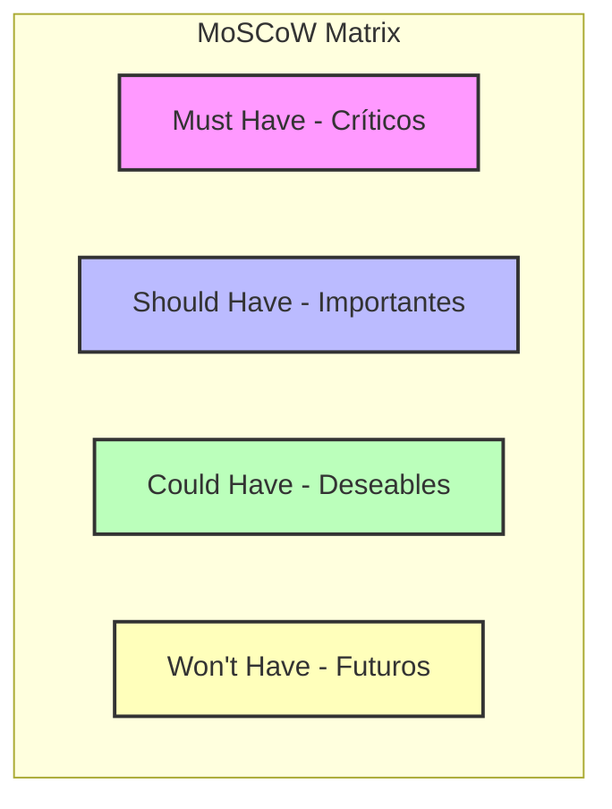

# Análisis de Requerimientos y Mapeo de Stakeholders — SGOHA

> **Proyecto:** Sistema de Generación Óptima de Horarios Académicos (SGOHA)  
> **Institución:** Universidad Continental  
> **Curso:** Taller de Proyecto 2  
> **Documento:** Análisis de Requerimientos Funcionales y No Funcionales Basado en Stakeholders  
> **Fecha:** Mayo 2026  

---

## 1. Introducción y Contexto

El **Sistema de Generación Óptima de Horarios Académicos (SGOHA)** es una herramienta tecnológica avanzada que utiliza programación por restricciones (**CP-SAT de Google OR-Tools**) para automatizar y optimizar la distribución horaria en la Universidad Continental. 

Aunque el prototipo funcional (PoC) resuelve de forma exitosa el núcleo del problema de asignación matemática (evitando colisiones físicas y de docentes en menos de 2 segundos), la transición hacia un entorno real de producción requiere un entendimiento profundo del ecosistema universitario. Este documento presenta una **identificación rigurosa de los stakeholders (interesados)** y **analiza los nuevos requerimientos funcionales (RF) y no funcionales (RNF)** detectados a partir de su retroalimentación, estructurando el camino para las futuras iteraciones del sistema.

---

## 2. Identificación y Mapeo de Stakeholders

Para asegurar el éxito del SGOHA en un entorno operativo, se han identificado cinco grupos clave de interesados. A continuación, se detallan sus roles, motivaciones y principales puntos de dolor (*pain points*) en la gestión de horarios:

| Stakeholder | Rol en el Ecosistema | Intereses Principales | Puntos de Dolor (*Pain Points*) |
| :--- | :--- | :--- | :--- |
| **Coordinador Académico / Director de Carrera** | Administrador principal del sistema. Responsable de planificar el semestre. | - Reducir el tiempo de confección de horarios de semanas a horas.<br>- Validar la disponibilidad docente de forma confiable.<br>- Poder realizar ajustes manuales rápidos post-generación. | - Trabajo manual repetitivo y propenso a errores humanos.<br>- Presión por resolver conflictos de última hora (renuncias de docentes, cambios de aulas).<br>- Dificultad para balancear preferencias docentes con la disponibilidad física. |
| **Docentes (Cuerpo Académico)** | Ejecutores de las clases programadas. | - Horarios compactos y contiguos (evitar "horas huecas").<br>- Respeto a sus turnos de trabajo y disponibilidad declarada.<br>- Minimizar traslados innecesarios entre campus. | - Clases dispersas (ej. lunes a primera hora y viernes a última hora).<br>- Asignación de aulas sin el equipamiento requerido para su materia.<br>- Falta de canales ágiles para reportar su disponibilidad o solicitar cambios. |
| **Estudiantes (Usuarios Finales)** | Consumidores de los horarios generados para su matrícula. | - Evitar cruces de asignaturas del mismo ciclo académico.<br>- Horarios agrupados que faciliten el transporte o el trabajo de medio tiempo.<br>- Acceso móvil rápido a su horario oficial. | - Cruce de materias obligatorias que retrasan su egreso.<br>- Horarios con ventanas de tiempo excesivamente largas en campus (ej. 4 horas libres entre clases).<br>- Enterarse tarde de cambios de aula o profesor. |
| **Dirección Académica / Decanatura** | Patrocinador y tomador de decisiones estratégicas a nivel institucional. | - Optimizar la tasa de uso de aulas y laboratorios (reducción de costos de infraestructura).<br>- Reducir la deserción estudiantil causada por problemas de horarios.<br>- Cumplir con estándares de acreditación educativa. | - Costo elevado de mantener aulas vacías por mala programación.<br>- Insatisfacción general del alumnado y cuerpo docente.<br>- Dificultad para generar reportes consolidados del uso del campus. |
| **Ingeniero de Sistemas (DevOps e Infraestructura)** | Diseñador de la arquitectura técnica, responsable de la estabilidad, integraciones y mantenibilidad del software. | - Modularidad del código y separación de responsabilidades (SoC).<br>- Cobertura y calidad de pruebas automatizadas (TDD $\ge 70\%$).<br>- Despliegues continuos automatizados (CI/CD) y seguridad de la información (SSO / JWT).<br>- Telemetría de logs y observabilidad del comportamiento de algoritmos complejos. | - Alta deuda técnica o falta de pruebas que provoquen regresiones.<br>- Carga manual e ineficiente de datos entre el frontend y el backend.<br>- Dificultad para diagnosticar cuellos de botella u optimizaciones fallidas del solver en caliente. |
| **Soporte Técnico / Helpdesk** | Personal técnico encargado de atender reportes de usuarios finales. | - Reducción en volumen de incidencias por fallos de red o errores de carga.<br>- Guías y herramientas sencillas de diagnóstico rápido. | - Clientes colgados o fallos silenciosos en la base de datos sin alertas claras.<br>- Saturación de quejas por modificaciones no notificadas en horarios de alumnos. |

---

## 3. Requerimientos Funcionales (RF)

### 3.1 Requerimientos Funcionales Actuales (Línea Base del PoC)
El sistema actual cuenta con los siguientes requerimientos funcionales ya implementados y validados mediante TDD:
*   **RF-01 (Seguridad):** Autenticación y autorización basada en roles (Administrador y Estudiante) vía tokens JWT.
*   **RF-02 (CRUD Cursos):** Mantenimiento completo de asignaturas con sus créditos, tipo (Teoría/Laboratorio) y período académico.
*   **RF-03 (CRUD Aulas):** Gestión de infraestructura física incluyendo aforo máximo y tipo de aula.
*   **RF-04 (CRUD Secciones):** Vinculación de cursos con docentes asignados y estimación de aforo.
*   **RF-05 (Búsqueda):** Filtrado y búsqueda rápida en grillas administrativas.
*   **RF-06 (Motor de Optimización):** Ejecución asíncrona del algoritmo CP-SAT con indicador de progreso.
*   **RF-07 (Restricción de Aulas):** Prevención matemática de superposición de clases en la misma aula.
*   **RF-08 (Restricción de Docentes):** Garantía de no superposición horaria para un docente.
*   **RF-09 (Restricción de Capacidad):** Asignación exclusiva de aulas cuyo aforo sea $\ge$ la demanda de la sección.
*   **RF-10 (Dashboard Estudiante):** Visualización interactiva y gráfica del horario asignado por ciclo y turno.
*   **RF-11 (Gestión de Sesiones):** Persistencia y cierre voluntario de sesión.
*   **RF-12 (Manejo de Infactibilidad):** Alerta clara si el motor matemático detecta que las restricciones no tienen solución factible.

---

### 3.2 Nuevos Requerimientos Funcionales Identificados con Stakeholders

A través del análisis del flujo de trabajo real en la Universidad Continental y reuniones simuladas con los stakeholders, se han levantado los siguientes requerimientos funcionales para expandir la solución:

#### 1. RF-Nue-01: Portal de Autogestión de Disponibilidad Docente
> [!NOTE]
> **Origen:** Levantado por los **Docentes** y el **Coordinador Académico**.
*   **Descripción:** El sistema debe proveer una interfaz web para que los docentes inicien sesión y registren de forma visual (mediante una cuadrícula de tiempo) su disponibilidad horaria preferida, su disponibilidad máxima obligatoria y sus solicitudes de bloques consecutivos para el próximo ciclo académico.
*   **Valor de Negocio:** Reduce en un 90% el tiempo de recolección de preferencias docentes por parte del coordinador académico y proporciona datos limpios para el motor matemático (alimentando las restricciones blandas y duras).

#### 2. RF-Nue-02: Módulo de Ajuste Manual Post-Optimización ("Drag-and-Drop Editor")
> [!NOTE]
> **Origen:** Levantado por el **Coordinador Académico**.
*   **Descripción:** Una vez generado el horario óptimo por el motor CP-SAT, el coordinador debe poder realizar ajustes manuales arrastrando y soltando (*drag-and-drop*) secciones en la cuadrícula visual. El sistema debe validar en tiempo real (en el frontend y backend) si este movimiento manual rompe alguna restricción dura (e.g., cruce de docente o aula) y advertir visualmente al usuario antes de confirmar el cambio.
*   **Valor de Negocio:** Permite manejar excepciones de última hora que no estaban contempladas en el modelo matemático sin tener que volver a ejecutar la optimización completa.

#### 3. RF-Nue-03: Integración Integrada con el Core Académico (Banner ERP / API Sync)
> [!NOTE]
> **Origen:** Levantado por el **Área de TI** y **Dirección Académica**.
*   **Descripción:** El sistema debe proveer un módulo de sincronización automática y por lotes (mediante llamadas a APIs REST y carga de archivos CSV estandarizados) para importar la carga académica de estudiantes, el catálogo oficial de cursos, la lista activa de docentes y la infraestructura física directamente desde el ERP institucional (e.g., Banner Student).
*   **Valor de Negocio:** Evita la doble digitación de datos, erradica errores de transcripción humana y asegura la coherencia de datos maestros con el sistema oficial de la universidad.

#### 4. RF-Nue-04: Soporte Multisede y Restricción de Desplazamiento Físico
> [!NOTE]
> **Origen:** Levantado por la **Dirección Académica** y **Docentes**.
*   **Descripción:** El sistema debe permitir registrar la "Sede" o "Campus" a la que pertenece cada aula física. El motor de optimización debe garantizar que ningún docente sea programado en diferentes sedes en el mismo día, o en su defecto, establecer una restricción de tiempo mínimo de traslado (e.g., 2 horas) entre bloques si el docente cambia de sede.
*   **Valor de Negocio:** Evita problemas logísticos graves y demoras de docentes por tráfico inter-campus, aumentando la puntualidad de las clases.

#### 5. RF-Nue-05: Módulo de Exportación de Horarios Multi-Formato
> [!NOTE]
> **Origen:** Levantado por **Estudiantes**, **Docentes** y **Coordinadores**.
*   **Descripción:** Permitir a los usuarios descargar sus horarios en diferentes formatos optimizados:
    *   **PDF:** Con diseño listo para imprimir (con branding institucional).
    *   **Excel/CSV:** Para análisis administrativo de uso de recursos.
    *   **iCal/ICS:** Para que los alumnos y profesores importen y sincronicen su horario directamente en calendarios personales (Google Calendar, Microsoft Outlook, Apple Calendar).
*   **Valor de Negocio:** Facilita la consulta del horario fuera de la plataforma del sistema, mejorando la adopción y la experiencia del usuario.

#### 6. RF-Nue-06: Sistema de Notificaciones Automatizadas ante Cambios Horarios
> [!NOTE]
> **Origen:** Levantado por **Estudiantes** y **Docentes**.
*   **Descripción:** Si un coordinador realiza una modificación manual en un horario ya publicado (cambio de aula, horario o docente), el sistema debe disparar automáticamente una notificación por correo electrónico y un mensaje (vía API de WhatsApp o notificaciones push) a todos los alumnos matriculados en esa sección y al docente asignado.
*   **Valor de Negocio:** Reduce las colisiones presenciales en los primeros días de clase y mantiene a la comunidad estudiantil informada al instante.

#### 7. RF-Nue-07: Dashboard Gerencial de Analítica de Recursos
> [!NOTE]
> **Origen:** Levantado por la **Dirección Académica / Decanatura**.
*   **Descripción:** Interfaz gráfica para directivos que muestre métricas clave de eficiencia post-generación:
    *   Porcentaje de ocupación física de aulas y laboratorios.
    *   Tasa de horas vacías ("huecos") promedio por docente y por estudiante.
    *   Nivel de satisfacción de las preferencias docentes (restricciones blandas).
    *   Comparativa de costos operativos y huella de carbono teórica (Green Software) entre distintas versiones de horarios.
*   **Valor de Negocio:** Provee una herramienta clave para la toma de decisiones estratégicas sobre adquisición de infraestructura o contratación de personal.

#### 8. RF-Nue-08: Bitácora de Auditoría de Cambios
> [!NOTE]
> **Origen:** Levantado por el **Ingeniero de Sistemas**.
*   **Descripción:** Registro inmutable de auditoría que guarde cada cambio manual realizado sobre los horarios. Cada registro debe incluir: ID del usuario administrador que realizó el cambio, fecha/hora exacta, valor anterior y valor nuevo.
*   **Valor de Negocio:** Aporta transparencia al proceso administrativo, facilitando el diagnóstico ante problemas de asignaciones indebidas y auditorías de licenciamiento.

#### 9. RF-Nue-09: Consola de Telemetría y Diagnóstico del Solver
> [!NOTE]
> **Origen:** Levantado por el **Ingeniero de Sistemas**.
*   **Descripción:** Interfaz técnica integrada en la consola de administración que permita visualizar las métricas clave de cada ejecución del solver CP-SAT: consumo máximo de RAM, porcentaje de CPU, tiempo total transcurrido, cantidad de variables y restricciones reducidas tras el pre-filtrado, y estatus final del motor.
*   **Valor de Negocio/Técnico:** Facilita la detección temprana de degradación del rendimiento de búsqueda matemática por crecimiento de datos sin requerir accesos directos al servidor o logs de archivos planos.

---

## 4. Requerimientos No Funcionales (RNF)

### 4.1 Requerimientos No Funcionales Actuales (Línea Base del PoC)
Definidos en la arquitectura del sistema actual para asegurar la excelencia del prototipo:
*   **RNF-01 (Rendimiento del API):** Respuestas a consultas GET en $\le$ 2 segundos en percentil 95.
*   **RNF-02 (Rendimiento del Solver):** Solución matemática factible en $\le$ 30 segundos para el dataset estándar (122 secciones).
*   **RNF-03 (Mantenibilidad):** Backend tipado con Pydantic y frontend con TypeScript al 100% (sin uso de `any`).
*   **RNF-04 (Escalabilidad):** Contenerización en Docker que soporte el escalamiento horizontal del API backend a 3 instancias.
*   **RNF-05 (Disponibilidad):** Retorno de error HTTP 503 ante la caída temporal de PostgreSQL, manejado con elegancia por la UI.

---

### 4.2 Nuevos Requerimientos No Funcionales Identificados con Stakeholders

Para elevar la robustez del sistema a los estándares corporativos de la Universidad Continental, se definen los siguientes requerimientos de calidad adicionales:

```
                            Nuevos Atributos de Calidad (RNF)
                                           │
         ┌───────────────────┬─────────────┴─────────────┬───────────────────┐
         │                   │                           │                   │
    Seguridad y SSO     Concurrencia               Accesibilidad       Portabilidad
    (Azure AD / JWT)    (Matrícula Peak)           (WCAG 2.1 AA)       (PWA Offline)
```

#### 1. RNF-Nue-01: Autenticación Unificada (Single Sign-On - SSO)
*   **Categoría:** Seguridad.
*   **Descripción:** El sistema debe integrarse con el proveedor de identidad institucional (Active Directory de Microsoft / Azure AD de la Universidad Continental) utilizando el protocolo OAuth 2.0 / OpenID Connect.
*   **Métrica de Verificación:** Los estudiantes y docentes deben poder iniciar sesión con su correo institucional (`@continental.edu.pe`) sin necesidad de crear contraseñas adicionales. Los tokens de sesión deben tener expiración forzosa cada 8 horas.

#### 2. RNF-Nue-02: Alta Disponibilidad y Concurrencia en Temporada de Matrícula
*   **Categoría:** Escalabilidad / Disponibilidad.
*   **Descripción:** Durante la semana de matrícula, el endpoint de lectura de horarios (`GET /api/schedules`) debe soportar una alta carga de peticiones simultáneas sin degradar su tiempo de respuesta.
*   **Métrica de Verificación:** Soportar hasta **10,000 usuarios concurrentes** activos consultando su horario simultáneamente, con tiempos de respuesta en la API de $\le$ 500 ms en el percentil 99. Se verificará mediante pruebas de estrés sintéticas con herramientas de benchmarking (e.g., Locust o JMeter) simulando este escenario.

#### 3. RNF-Nue-03: Tolerancia a Fallos y Degradación Elegante del Motor de Optimización
*   **Categoría:** Robustez / Usabilidad.
*   **Descripción:** Si el motor de optimización se encuentra ante un escenario matemáticamente complejo que exceda el límite máximo de ejecución (e.g., 60 segundos), el backend no debe colgarse ni dejar el hilo bloqueado. Debe retornar de forma segura la mejor solución intermedia encontrada hasta ese momento (marcada como "factible pero no óptima") o, en su defecto, identificar y listar las restricciones en conflicto directo (IIS - Irreducible Inconsistent Subsystem).
*   **Métrica de Verificación:** Ante una simulación de datos con infactibilidad introducida ad-rede, el sistema detendrá el solver al llegar al timeout y presentará un modal detallando qué sección o docente causa el cuello de botella.

#### 4. RNF-Nue-04: Accesibilidad Web para Estudiantes con Discapacidad
*   **Categoría:** Usabilidad.
*   **Descripción:** La interfaz visual del horario debe ser accesible para personas con discapacidades visuales o de movilidad, permitiendo la navegación fluida y la lectura de datos mediante tecnologías de apoyo.
*   **Métrica de Verificación:** El frontend debe cumplir con el nivel **WCAG 2.1 Nivel AA**. Los lectores de pantalla (como NVDA o JAWS) deben poder narrar adecuadamente la grilla de horarios generada, y todos los botones y campos de entrada deben tener soporte para navegación por teclado (0 trampas de teclado).

#### 5. RNF-Nue-05: PWA con Soporte de Horarios Offline (Modo Desconectado)
*   **Categoría:** Portabilidad / Confiabilidad.
*   **Descripción:** El frontend de los estudiantes debe estar configurado como una Aplicación Web Progresiva (PWA). Esto almacenará en caché local el horario del alumno la primera vez que inicie sesión con internet.
*   **Métrica de Verificación:** Al simular la desconexión total del internet en un smartphone (Modo Avión), el estudiante debe poder abrir el sitio del SGOHA y visualizar su cuadrícula horaria de forma offline con los últimos datos sincronizados.

#### 6. RNF-Nue-06: Trazabilidad y Cumplimiento Normativo (SUNEDU)
*   **Categoría:** Cumplimiento (Compliance).
*   **Descripción:** El almacenamiento de datos y la auditoría deben cumplir con los requisitos establecidos por la Superintendencia Nacional de Educación Superior Universitaria (SUNEDU) respecto a la transparencia en la idoneidad docente y distribución de carga lectiva presencial.
*   **Métrica de Verificación:** El sistema debe permitir auditar de manera inmediata que ningún docente a tiempo completo exceda las horas de enseñanza que la ley universitaria estipula, emitiendo alertas automatizadas previas a la confirmación de la optimización.

#### 7. RNF-Nue-07: Pruebas Automatizadas e Integración Continua (CI/CD)
*   **Categoría:** Mantenibilidad y Confiabilidad.
*   **Descripción:** El sistema debe contar con un flujo de integración continua que valide automáticamente la calidad del código, el tipado de TypeScript y ejecute las pruebas TDD garantizando que no se introduzcan regresiones funcionales.
*   **Métrica de Verificación:** Cada Pull Request hacia la rama principal debe gatillar un pipeline en GitHub Actions que compruebe la ausencia de errores lint, valide el tipado estático y verifique que la suite de pruebas unitarias (`pytest`) mantiene una cobertura $\ge 70\%$.

---

## 5. Priorización MoSCoW de Requerimientos Nuevos

Para guiar el desarrollo ágil en los próximos sprints, se priorizan los requerimientos identificados utilizando la metodología MoSCoW:



### 1. Must Have (Obligatorio en la Próxima Iteración)
*   **RF-Nue-02:** Editor manual Drag-and-Drop con validación de colisiones (vital para la flexibilidad operativa).
*   **RF-Nue-04:** Soporte para sedes múltiples y tiempos de traslado de docentes (evita problemas logísticos graves).
*   **RNF-Nue-03:** Degradación elegante del motor CP-SAT y reporte de restricciones en conflicto (previene caídas del backend).
*   **RNF-Nue-07 (Ing. Sistemas):** Pipeline de CI/CD automatizado con validación de TDD y cobertura $\ge 70\%$.

### 2. Should Have (Debería incluirse en el corto plazo)
*   **RF-Nue-01:** Portal de disponibilidad de horarios para los docentes.
*   **RF-Nue-05:** Exportación de horarios en formato iCal/ICS y PDF oficial.
*   **RF-Nue-09 (Ing. Sistemas):** Consola de telemetría y diagnóstico de rendimiento del solver.
*   **RNF-Nue-01:** Integración de Single Sign-On (SSO) con Azure AD institucional.

### 3. Could Have (Podría incluirse si hay recursos disponibles)
*   **RF-Nue-06:** Notificación automática de cambios de aula/horario vía WhatsApp/Email.
*   **RF-Nue-07:** Dashboard gerencial de analítica de uso de recursos físicos y de personal.
*   **RNF-Nue-05:** Configuración PWA para consulta de horarios offline en móviles.

### 4. Won't Have (No se implementará por ahora, queda en el backlog de largo plazo)
*   **RF-Nue-03:** Integración bidireccional directa en tiempo real con Banner (se sustituye temporalmente con cargas por lote de archivos CSV).
*   **RF-Nue-08:** Bitácora inmutable basada en firmas digitales.

---

## 6. Conclusión y Recomendación para la Exposición al Docente

> [!TIP]
> **Enfoque de Defensa Académica:**  
> Al exponer este documento ante el jurado/docente, el equipo debe destacar que el diseño de un sistema empresarial como el SGOHA no se limita a programar un algoritmo, sino a comprender cómo interactúan las personas con la tecnología. 
>
> La inclusión de este análisis demuestra al docente:
> 1.  **Rigurosidad en Ingeniería de Requisitos:** El proyecto no asume un entorno idealizado, sino que reconoce las complejidades operativas de la Universidad Continental (como el tráfico entre campus, los docentes de última hora y el volumen de usuarios en matrícula).
> 2.  **Viabilidad del Producto:** Al proponer una priorización MoSCoW y justificar la arquitectura orientada a la matemática de CP-SAT (PERN/FastAPI vs MERN), el equipo demuestra capacidad de resolver *trade-offs* técnicos y comerciales de la vida real.
