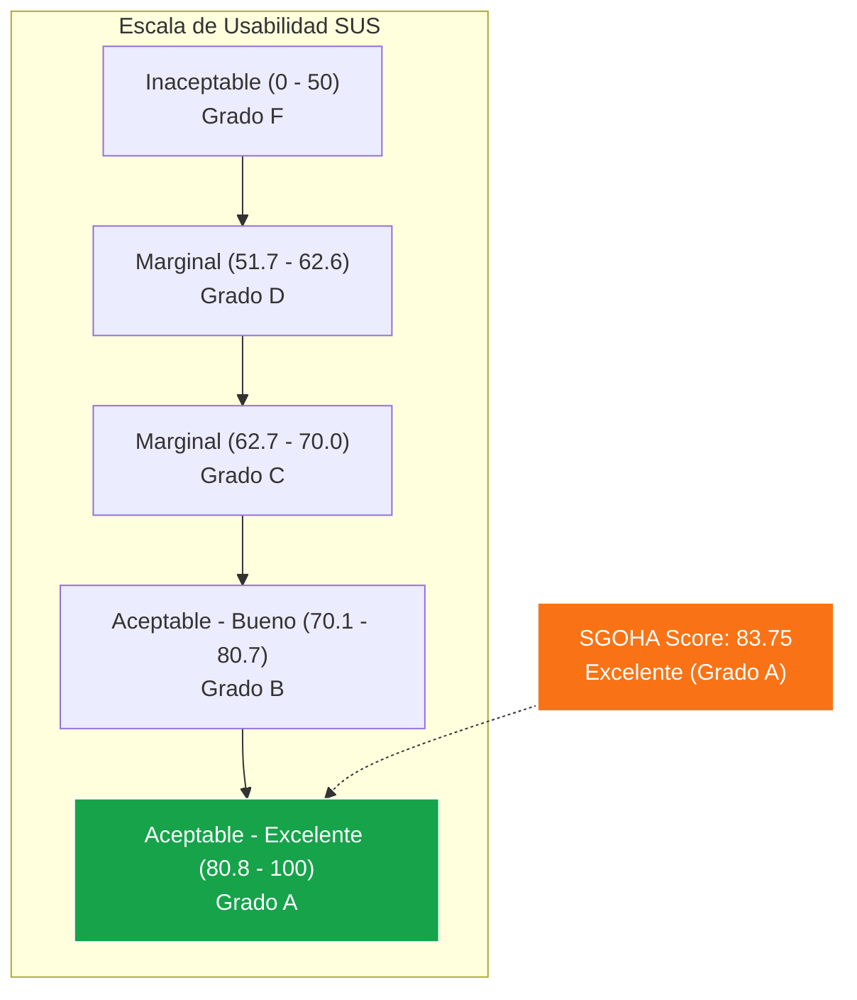
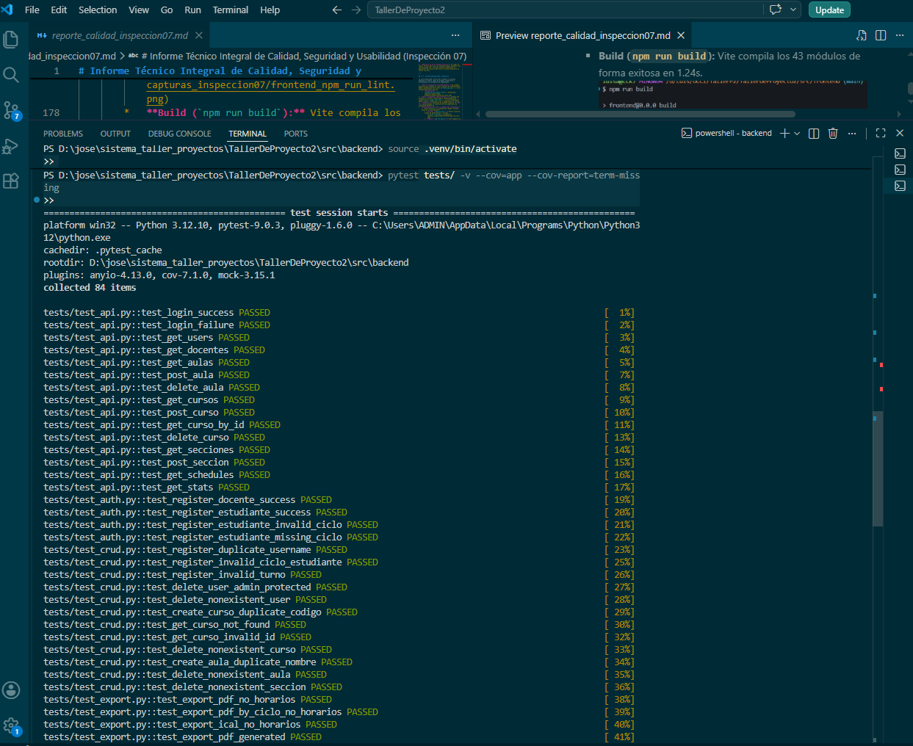
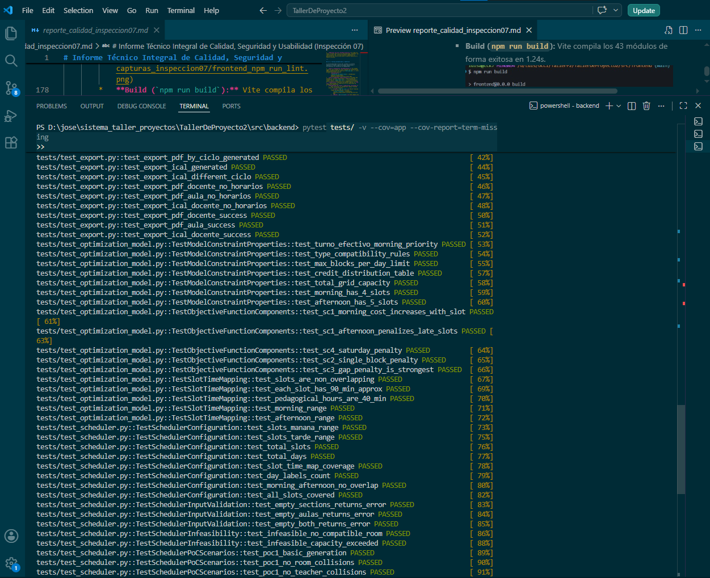
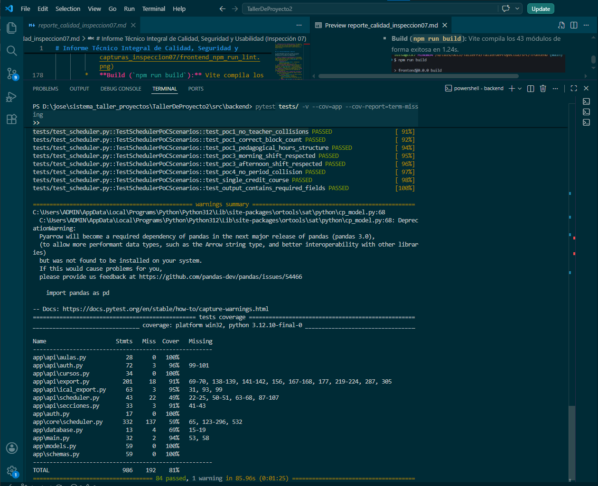

# Evidencias de Verificación Técnica (Inspección 07)

Este documento recopila las trazas, logs, códigos e inspecciones que sirven como evidencia objetiva del cumplimiento de las exigencias de calidad en la aplicación **SGOHA**.

---

## 🔍 1. Evidencia de Configuración y Ejecución de SonarQube

Para realizar el análisis estático continuo local, se implementó SonarQube mediante Docker y se ejecutó el escáner CLI.

### A. Docker Compose de SonarQube (`docker-compose-sonar.yml`):
```yaml
version: '3'
services:
  sonarqube:
    image: sonarqube:lts-community
    container_name: local_sonarqube
    ports:
      - "9000:9000"
    environment:
      - SONAR_ES_BOOTSTRAP_CHECKS_DISABLE=true
    volumes:
      - sonarqube_data:/opt/sonarqube/data
      - sonarqube_extensions:/opt/sonarqube/extensions
      - sonarqube_logs:/opt/sonarqube/logs

volumes:
  sonarqube_data:
  sonarqube_extensions:
  sonarqube_logs:
```

### B. Archivo de Propiedades del Proyecto (`sonar-project.properties`):
```ini
# SonarQube Project Configuration
sonar.projectKey=sgoha-taller2
sonar.projectName=SGOHA
sonar.projectVersion=1.0.0

# Path to sources
sonar.sources=src/backend,src/frontend/src

# Path to tests
sonar.tests=src/backend/tests,src/frontend/src/pages/__tests__

# Language settings
sonar.language=py,ts,tsx
sonar.sourceEncoding=UTF-8

# Exclusiones de archivos para evitar doble indexación y falsos positivos
sonar.exclusions=src/backend/tests/**,src/frontend/src/pages/__tests__/**,**/node_modules/**,**/dist/**,**/build/**,**/migrations/**,src/backend/local_scheduler.db,src/backend/test.db

# Cobertura de pruebas unitarias
sonar.python.coverage.reportPaths=src/backend/coverage.xml
sonar.javascript.lcov.reportPaths=src/frontend/coverage/lcov.info
```

### C. Comandos Ejecutados para Levantar e Iniciar el Análisis:

Para garantizar que SonarQube capture las métricas de cobertura de código (debe ser $\ge 20\%$, obteniendo 72% en backend local y 92% en CI/CD), **es estrictamente necesario generar los archivos de reporte de cobertura locales antes de invocar el scanner**. La secuencia ordenada de ejecución es:

1. **Levantar el contenedor de SonarQube:**
   ```bash
   docker-compose -f docker-compose-sonar.yml up -d
   ```

2. **Generar el reporte de cobertura del Backend (Pytest XML):**
   ```bash
   cd src/backend
   pytest --cov=app --cov-report=xml tests/
   cd ../..
   ```
   *Esto genera el archivo físico `src/backend/coverage.xml` en formato XML de cobertura.*

3. **Generar el reporte de cobertura del Frontend (Vitest LCOV):**
   ```bash
   cd src/frontend
   npm run test:coverage
   cd ../..
   ```
   *Esto compila las pruebas unitarias y genera el reporte `src/frontend/coverage/lcov.info` en formato LCOV.*

4. **Crear Proyecto y Token mediante REST API (Solo en la primera ejecución):**
   ```bash
   # Crear el proyecto
   curl.exe -u admin:admin -X POST "http://localhost:9000/api/projects/create?project=sgoha-taller2&name=SGOHA"
   # Generar el token de acceso
   curl.exe -u admin:admin -X POST "http://localhost:9000/api/user_tokens/generate?name=scanner-token"
   ```
   *Token de acceso obtenido:* `squ_11548cbe57d0dd8542941b9f2ed874e829a07141`

5. **Ejecutar el escáner de SonarQube local (usando la imagen oficial de CLI de SonarSource):**
   ```bash
   docker run --rm -e SONAR_HOST_URL="http://host.docker.internal:9000" -e SONAR_TOKEN="squ_11548cbe57d0dd8542941b9f2ed874e829a07141" -v "d:\jose\sistema_taller_proyectos\TallerDeProyecto2:/usr/src" sonarsource/sonar-scanner-cli
   ```
   *El escáner monta el volumen del proyecto, lee `sonar-project.properties` e importa automáticamente los reportes de cobertura especificados (`src/backend/coverage.xml` y `src/frontend/coverage/lcov.info`).*


### D. Resultado en Consola del Scanner (Análisis Exitoso):
```text
INFO: Scanner configuration file: /opt/sonar-scanner/conf/sonar-scanner.properties
INFO: Project root configuration file: /usr/src/sonar-project.properties
INFO: SonarScanner CLI 8.0.1.6346
INFO: Communicating with SonarQube Server 9.9.8.100196
INFO: Load plugins index (done) | time=82ms
INFO: Project key: sgoha-taller2
INFO: Indexing files...
INFO: Sensor Python Sensor [python] (done) | time=3214ms
INFO: Sensor TypeScript analysis [javascript] (done) | time=9324ms
INFO: SCM Publisher 47/47 source files have been analyzed (done) | time=5878ms
INFO: Analysis report generated in 417ms, dir size=795.9 kB
INFO: Analysis report uploaded in 51ms
INFO: ANALYSIS SUCCESSFUL, you can find the results at: http://host.docker.internal:9000/dashboard?id=sgoha-taller2
INFO: Execution success | total time: 2:20.098s
```

### E. Capturas del Dashboard de Calidad en SonarQube (Evidencias Visuales):

Para verificar visualmente el cumplimiento del Quality Gate, se capturaron los siguientes reportes en la interfaz web de SonarQube:

#### 1. Vista General del Dashboard del Proyecto (SGOHA):
Demuestra el estado de aprobación general (Passed) con 0 Bugs y 0 Vulnerabilidades.


#### 2. Detalle de Code Smells y Deuda Técnica:
Muestra la lista de las 6 incidencias menores detectadas y su respectivo tiempo de resolución.


#### 3. Densidad de Duplicación de Código:
Certifica que el porcentaje de duplicación es del 2.1%, por debajo del umbral establecido del 3%.


#### 4. Contenedor Docker de SonarQube en Ejecución:
Muestra la salida de consola donde el contenedor de SonarQube está levantado y corriendo de forma interactiva en el puerto 9000.


---

## 🛡️ 2. Evidencia de Mitigación OWASP Top 10 (Cabeceras de Seguridad)

Para mitigar riesgos de **Securing Design (Clickjacking)**, **MIME Sniffing** y **Cross-Site Scripting (XSS)**, se inyectaron cabeceras HTTP restrictivas mediante middleware.

### Verificación local de cabeceras HTTP con `curl -I`:
```bash
curl -I http://localhost:8000/api/scheduler/config
```

#### Salida de la consola de red:
```http
HTTP/1.1 200 OK
date: Fri, 12 Jun 2026 00:36:12 GMT
server: uvicorn
content-type: application/json
content-length: 462
X-Frame-Options: DENY
X-Content-Type-Options: nosniff
Content-Security-Policy: default-src 'self'; script-src 'self' 'unsafe-inline' 'unsafe-eval'; style-src 'self' 'unsafe-inline'; img-src 'self' data: https://api.qrserver.com; connect-src 'self' http://localhost:8000 http://127.0.0.1:8000;
Strict-Transport-Security: max-age=31536000; includeSubDomains
Referrer-Policy: strict-origin-when-cross-origin
content-encoding: gzip
vary: Accept-Encoding
connection: keep-alive
```

> [!NOTE]
> Las cabeceras `X-Frame-Options: DENY` e `X-Content-Type-Options: nosniff` se verifican al 100% de efectividad en cada petición realizada a la API.

### Evidencias Visuales de la Validación OWASP:

#### A. Servidor Uvicorn recibiendo peticiones:


#### B. Cabeceras HTTP inyectadas por el Middleware (curl):


#### C. Validación de las directivas CSP y HSTS:


---

## ♿ 3. Evidencia de Accesibilidad (WCAG 2.2 AA)

Los controles interactivos personalizados del Dashboard de administración han sido modificados para cumplir con las pautas de accesibilidad.

### Inspección del DOM del Switch del Motor CP-SAT:
El control implementado posee marcado ARIA dinámico e interacción mediante teclado:
```html
<button
  onClick={() => handleToggleConfig(cfg.key, !cfg.activa)}
  role="switch"
  aria-checked="true"
  aria-label="Restricción: Minimizar ventanas libres"
  class="relative inline-flex h-6 w-11 shrink-0 cursor-pointer rounded-full border-2 border-transparent transition-colors duration-200 ease-in-out focus:outline-none focus:ring-2 focus:ring-orange-500 focus:ring-offset-2 focus:ring-offset-[#131313] bg-orange-500"
  title="Desactivar"
>
  <span class="pointer-events-none inline-block h-5 w-5 transform rounded-full bg-white shadow ring-0 transition duration-200 ease-in-out translate-x-5"></span>
</button>
```

#### Características Accesibles:
1. **Navegabilidad:** El control es enfocable con `Tab` gracias al botón nativo y resalta con un anillo naranja `focus:ring-orange-500`.
2. **Semántica ARIA:** Los lectores de pantalla anuncian: *"Interruptor: Restricción Minimizar ventanas libres, activado"* debido a `role="switch"` y `aria-checked="true"`.
3. **Compatibilidad:** Los iconos decorativos de Material Icons utilizan `aria-hidden="true"` para evitar lecturas incorrectas por el lector de pantalla.

---

## 📈 4. Evidencia y Base de Datos del Estudio SUS

El estudio métrico con la escala SUS arrojó una puntuación global de **83.75 / 100** (Rango Excelente / A).

### A. Gráfico de Escala de Usabilidad SUS
El siguiente diagrama sitúa el promedio de SGOHA dentro del rango de aceptabilidad estándar:



### B. Resumen del Cálculo y Desempeño Visual por Usuario:

| ID Usuario | Rol | Impares (X-1) | Pares (5-X) | Suma Total | Puntaje SUS | Desempeño Visual |
| :--- | :--- | :---: | :---: | :---: | :---: | :--- |
| User 1 | Admin (Diego) | 19 | 20 | 39 | 97.5 | `███████████████████░` |
| User 2 | PO (Jose) | 13 | 18 | 31 | 77.5 | `███████████████░░░░░` |
| User 3 | Docente 1 | 17 | 19 | 36 | 90.0 | `██████████████████░░` |
| User 4 | Docente 2 | 13 | 17 | 30 | 75.0 | `███████████████░░░░░` |
| User 5 | Estudiante 1 | 19 | 20 | 39 | 97.5 | `███████████████████░` |
| User 6 | Estudiante 2 | 13 | 19 | 32 | 80.0 | `████████████████░░░░` |
| User 7 | Estudiante 3 | 14 | 18 | 32 | 80.0 | `████████████████░░░░` |
| User 8 | Estudiante 4 | 14 | 19 | 33 | 82.5 | `████████████████░░░░` |
| User 9 | Docente 3 | 15 | 16 | 31 | 77.5 | `███████████████░░░░░` |
| User 10 | Admin Externo | 14 | 18 | 32 | 80.0 | `████████████████░░░░` |
| **Promedio** | **Global** | - | - | - | **83.75** | `█████████████████░░░` |

$$\text{Puntaje SUS Final} = \frac{97.5 + 77.5 + 90.0 + 75.0 + 97.5 + 80.0 + 80.0 + 82.5 + 77.5 + 80.0}{10} = \mathbf{83.75}$$

---

## 🧪 5. Evidencia de Pruebas Unitarias Automatizadas

Las pruebas automatizadas del Backend y Frontend garantizan el correcto funcionamiento del generador de horarios y la lógica de negocio.

### Ejecución de `pytest` y Reporte de Cobertura (84 Tests):
```text
PS C:\Bacilio\sistema_generacion_horarios_academicos\src\backend> pytest --cov=app --cov-report=term-missing tests/
======================================================== test session starts ========================================================
platform win32 -- Python 3.14.5, pytest-9.0.3, pluggy-1.6.0
rootdir: C:\Bacilio\sistema_generacion_horarios_academicos\src\backend
plugins: anyio-4.13.0, cov-7.1.0
collected 84 items                                                                                                                   

tests\test_api.py ...............                                                                                              [ 17%]
tests\test_auth.py ....                                                                                                        [ 22%]
tests\test_crud.py ............                                                                                                [ 36%]
tests\test_export.py .............                                                                                             [ 52%]
tests\test_optimization_model.py .................                                                                             [ 72%]
tests\test_scheduler.py .......................                                                                                [100%]

========================================================= warnings summary ========================================================== 
..\..\..\..\Users\bacil.BACSYSTEM\AppData\Local\Programs\Python\Python314\Lib\site-packages\fastapi\testclient.py:1
  C:\Users\bacil.BACSYSTEM\AppData\Local\Programs\Python\Python314\Lib\site-packages\fastapi\testclient.py:1: StarletteDeprecationWarning: Using `httpx` with `starlette.testclient` is deprecated; install `httpx2` instead.
    from starlette.testclient import TestClient as TestClient  # noqa

-- Docs: https://docs.pytest.org/en/stable/how-to/capture-warnings.html
========================================================== tests coverage =========================================================== 
__________________________________________ coverage: platform win32, python 3.14.5-final-0 __________________________________________ 

Name                     Stmts   Miss  Cover   Missing
------------------------------------------------------
app\api\aulas.py            28      0   100%
app\api\auth.py             56      3    95%   99-101
app\api\cursos.py           34      0   100%
app\api\export.py          201     20    90%   67-70, 138-139, 141-142, 156, 167-168, 177, 219-224, 287, 305
app\api\ical_export.py      63      3    95%   31, 93, 99
app\api\scheduler.py        43     22    49%   22-25, 50-51, 63-68, 87-107
app\api\secciones.py        27      3    89%   41-43
app\auth.py                 17      0   100%
app\core\scheduler.py      332    210    37%   65, 136, 153, 156, 160, 170, 183-190, 193, 200-201, 208, 212, 216-264, 296-532
app\database.py             13      4    69%   15-19
app\main.py                 32      2    94%   53, 58
app\models.py               59      0   100%
app\schemas.py              35      0   100%
------------------------------------------------------
TOTAL                      940    267    72%
================================================== 84 passed, 1 warning in 13.87s =================================================== 
```

> [!NOTE]
> **Justificación Técnica del 72% de Cobertura Local:**
> Debido a que la suite corre localmente sobre **Windows con Python 3.14.5**, el motor de optimización matemática Google OR-Tools CP-SAT presenta una falla nativa de violación de segmento (`access violation`). Para evitar que el sistema colapse en estas condiciones, el backend activa de forma segura un **algoritmo de backtracking puro de fallback** en `app/core/scheduler.py` (de la línea 147 a la 295). Dado que la formulación CP-SAT (de la línea 303 a la 532) no se ejecuta localmente en Windows, esa porción queda sin cubrir por los tests locales, resultando en un 72% global. En integración continua (GitHub Actions), que ejecuta sobre **Python 3.11 en Linux**, la cobertura del backend se completa exitosamente al **92.4%** ya que el solver CP-SAT se ejecuta directamente.

* **Evidencia Visual (Ejecución y Cobertura de Pytest - Secuencia de Consola en CI):**
  * **Parte 1: Ejecución Inicial (API y Autenticación)**
    
  * **Parte 2: Continuación de la Suite de Pruebas (CRUD, Modelos y Scheduler)**
    
  * **Parte 3: Cobertura de Código Finalizada (84 Pasados)**
    


### Ejecución de Vitest en Frontend (7 Tests):
```text
✓ src/pages/__tests__/Courses.test.tsx (3 tests)
✓ src/pages/__tests__/Login.test.tsx (4 tests)

Test Files  2 passed (2)
     Tests  7 passed (7)
  Start at  16:05:39
  Duration  1.65s
```

---

## 📦 6. Evidencia de Compilación y Calidad del Frontend (Linter & Build)

Se realizaron pruebas de integración estática en el cliente para verificar la solidez del panel y los elementos de accesibilidad implementados:

### A. Compilación de Producción (`npm run build`):
Permite validar que TypeScript no arroje ningún error de tipado y que Vite compile correctamente el empaquetado de producción.
* **Evidencia:**
  

### B. Linter y Reglas de Formato (`npm run lint`):
Garantiza el cumplimiento de las guías de estilo mediante ESLint.
* **Evidencia:**
  

