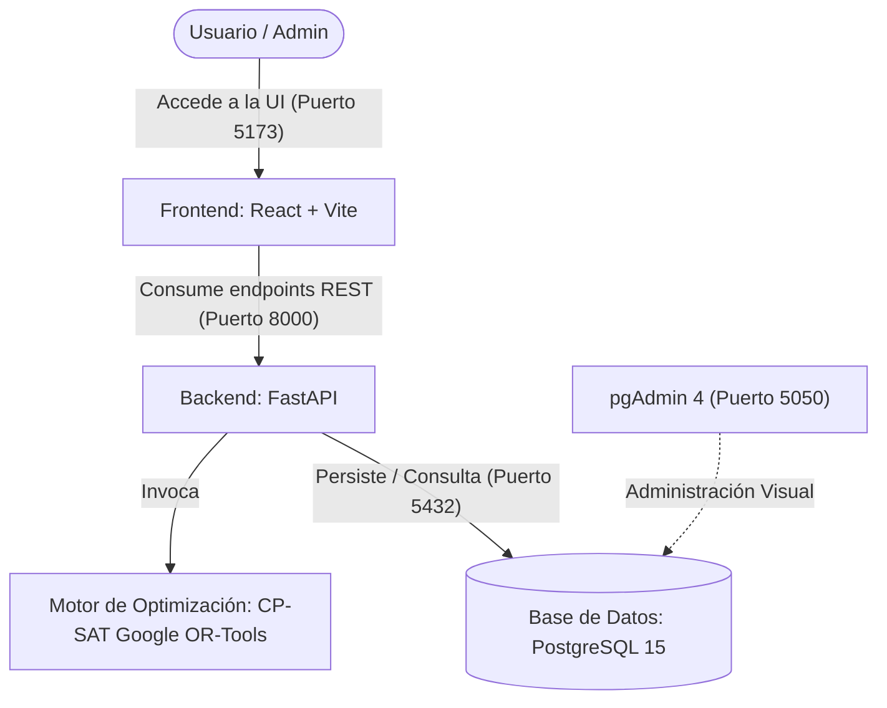
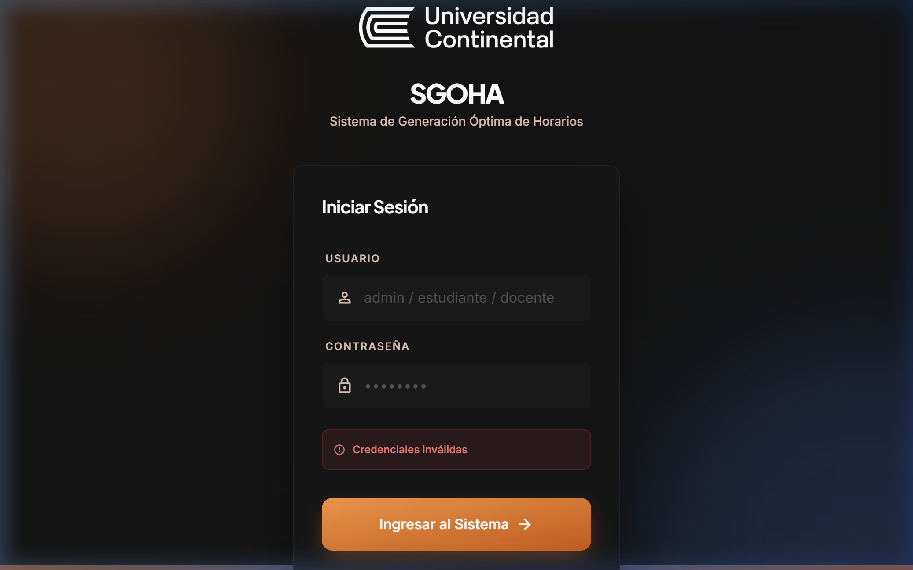
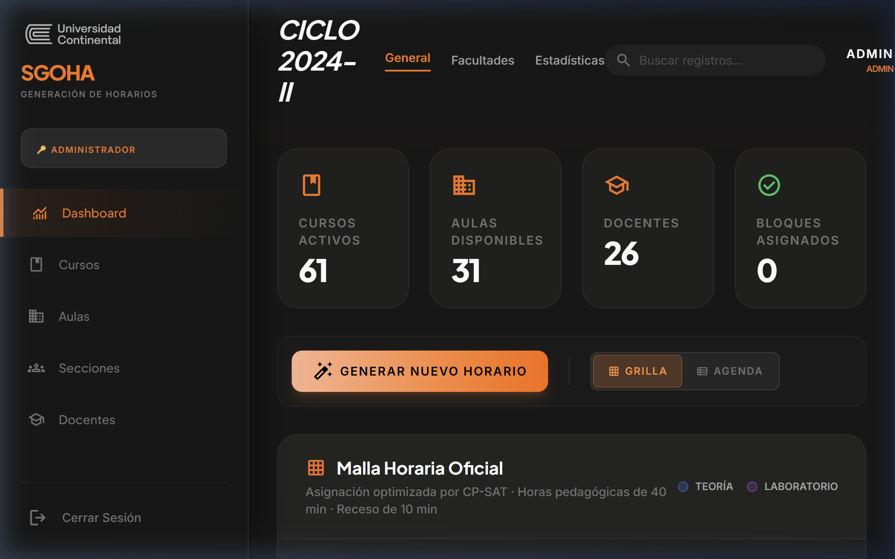

# Documentación de Capacitación y Operación (Training & Ops Manual)

Este documento sirve como guía de transferencia de conocimiento para el equipo de operaciones, administradores de TI e ingenieros de mantenimiento encargados del despliegue, monitoreo y soporte a largo plazo del sistema **SGOHA (Sistema de Gestión y Optimización de Horarios Académicos)**. Adicionalmente, resume la capacitación interna y externa realizada a lo largo del proyecto.

---

## 🏗️ 1. Arquitectura Lógica de la Solución

La plataforma **SGOHA** adopta una arquitectura de microservicios contenerizados y desacoplados que interactúan de la siguiente manera:



### Componentes y Tecnologías Clave:
1.  **Frontend (UI)**: React 18, TypeScript, Vite y Tailwind CSS. Implementa un diseño premium y adaptativo con soporte para accesibilidad web (normas WCAG 2.1 AA).
2.  **Backend (Core API)**: FastAPI (Python 3.11). Provee endpoints REST, inyección de seguridad y orquestación del solucionador.
3.  **Motor de Optimización**: Solucionador **CP-SAT** integrado dentro de Google OR-Tools. Modela restricciones matemáticas duras y blandas para generar la malla horaria ideal en segundos.
4.  **Base de Datos**: PostgreSQL 15. Almacena las entidades académicas (cursos, aulas, secciones, usuarios) y la configuración de las restricciones del motor.

---

## 🛠️ 2. Guía de Instalación y Despliegue de Entornos

El sistema está completamente contenerizado mediante **Docker** y **Docker Compose**, lo que garantiza un despliegue idéntico y reproducible tanto en desarrollo local como en producción.

### 2.1 Prerrequisitos del Sistema:
*   **Docker Engine** versión 24.0.0 o superior.
*   **Docker Compose V2** instalado y configurado en el PATH del sistema operativo.
*   Mínimo de **4 GB de RAM** disponibles para la compilación y ejecución de contenedores.

### 2.2 Pasos Detallados para el Despliegue:

1.  **Clonar el repositorio de la plataforma:**
    ```bash
    git clone https://github.com/DiegoOreGonzales/TallerDeProyecto2.git
    cd TallerDeProyecto2
    ```

2.  **Verificar el archivo de orquestación:**
    Asegúrese de que el archivo `docker-compose.yml` contenga las definiciones correctas de puertos y variables de entorno para los servicios `db`, `pgadmin`, `backend` y `frontend`.

3.  **Construir y levantar los servicios:**
    Ejecute el siguiente comando para compilar las imágenes locales e iniciar la red de contenedores en segundo plano:
    ```bash
    docker-compose up -d --build
    ```
    *Este paso descargará las imágenes base (Alpine, Postgres, pgAdmin), instalará dependencias de Node.js y Python, y levantará la infraestructura.*

4.  **Verificar el estado de los servicios:**
    Confirme que los 4 contenedores estén en estado *Up (Healthy)*:
    ```bash
    docker-compose ps
    ```
    Los servicios se mapearán localmente en las siguientes direcciones:
    *   **Frontend UI**: `http://localhost:5173`
    *   **Backend API**: `http://localhost:8000` (Documentación interactiva Swagger en `/docs`)
    *   **pgAdmin 4**: `http://localhost:5050` (Credenciales por defecto: `admin@ucontinental.edu.pe` / `admin123`)
    *   **PostgreSQL**: Mapeado al puerto `5432` de la máquina anfitriona.

5.  **Ejecutar semillas de inicialización (Database Seeder):**
    Para precargar el plan de estudios completo de Ingeniería de Sistemas (ciclos 1 al 10), 15 aulas físicas y la configuración por defecto del solucionador, ejecute:
    ```bash
    docker-compose exec backend python seed.py
    ```

---

## 💻 3. Manuales de Usuario por Rol

### 3.1 Flujo Operativo para el Administrador (Dashboard UI):
1.  **Autenticación**: Ingrese a la UI. Seleccione el rol de **Administrador** (credenciales del seeder: usuario `admin`, contraseña `admin`).
    
    

2.  **Configuración del Motor CP-SAT (Panel de Restricciones)**:
    En la parte superior del Dashboard se listan las restricciones activas en la base de datos. Cada restricción posee un interruptor (*switch*) accesible mediante teclado y lectores de pantalla:
    *   **Restricciones Duras (Hard Constraints - Obligatorias)**:
        *   *No colisión de Docentes*: Evita que un docente dicte en dos aulas al mismo tiempo.
        *   *No colisión de Aulas*: Impide que un aula albergue dos secciones concurrentes.
        *   *No colisión de Ciclo/Turno*: Garantiza que cursos del mismo ciclo y turno no se crucen para evitar problemas de matrícula.
        *   *Carga Máxima Docente*: Limita la labor docente a un máximo de 30 bloques semanales.
    *   **Preferencias Blandas (Soft Constraints - Optimizables)**:
        *   *Minimizar ventanas libres*: Agrupa las clases de los alumnos de forma compacta.
        *   *Evitar bloques sueltos*: Evita que el alumno asista a la universidad por una sola hora de clase.
        *   *Respetar turnos preferidos*: Prioriza los horarios en base a las preferencias de las secciones.
3.  **Generación de la Optimización**:
    Haga clic en el botón naranja **"Generar Nuevo Horario"**. La interfaz deshabilitará controles para evitar ediciones y mostrará un spinner con el mensaje *"Optimizando con CP-SAT..."*. En un periodo promedio de **15 a 30 segundos**, el motor retornará la matriz óptima de asignación.
4.  **Visualización e Inspección**:
    *   **Vista de Grilla**: Muestra la distribución tradicional por días (Lunes a Sábado) y bloques de hora.
    *   **Vista de Agenda (Lista)**: Agrupa el horario secuencialmente por días, ideal para lectura lineal y dispositivos móviles.
    *   **Modal de Detalle**: Al hacer clic en cualquier bloque de clase, se abre un modal con información de las horas pedagógicas de 40 minutos con sus respectivos recesos de 10 minutos.
    
    

5.  **Exportación y Descargas**:
    *   **PDF Completo**: Descarga el reporte imprimible de la malla completa.
    *   **Exportar Calendario (iCal)**: Descarga el archivo de integración para importar directamente en Google Calendar.

### 3.2 Flujo del Estudiante:
1.  **Inicio de Sesión**: Seleccione el rol de **Estudiante** y elija su ciclo académico (ej. `Periodo 8` para alumnos de 8vo ciclo) y su turno preferido (`MAÑANA`, `TARDE` o `COMPLETO`). Credenciales de prueba: usuario `estudiante_c8`, contraseña `ucontinental`.
2.  **Visualización Adaptada**: El Dashboard del estudiante ocultará de forma inteligente las opciones de configuración de restricciones del motor CP-SAT y el botón de generación.
3.  **Filtrado Inteligente de Turno (De-duplicación)**: Si el estudiante seleccionó el turno `COMPLETO`, el frontend de React aplica de forma automática un algoritmo de de-duplicación. Si una asignatura se ofrece en la mañana y tarde, la UI priorizará mostrar la sección de la mañana, evitando la duplicidad visual en el calendario.
4.  **Descarga**: El estudiante tiene habilitado el botón para descargar únicamente el **PDF de su Ciclo** y exportar su calendario a Google Calendar mediante **iCal**.

### 3.3 Flujo del Docente:
1.  **Inicio de Sesión**: Seleccione el rol de **Docente** (credenciales: usuario `docente_demo`, contraseña `docente`).
2.  **Visualización de Carga Académica**: El docente puede inspeccionar en la grilla los días y bloques asignados a sus clases semanales y el aula correspondiente.

---

## ⚙️ 4. Manual de Mantenimiento y Operaciones (TI)

### 4.1 Monitoreo de logs en Tiempo Real:
```bash
# Logs del backend FastAPI
docker-compose logs -f backend

# Logs del motor PostgreSQL
docker-compose logs -f db
```

### 4.2 Gestión de Respaldos de Datos (Backups):
*   **Generar una Copia de Seguridad:**
    ```bash
    docker-compose exec db pg_dump -U admin scheduling_system > backup_horarios.sql
    ```
*   **Restaurar una Copia de Seguridad:**
    ```bash
    docker-compose exec -T db psql -U admin scheduling_system < backup_horarios.sql
    ```

---

## 🎓 5. Historial de Capacitación del Proyecto

### 5.1 Capacitación Interna del Equipo de Desarrollo (Sprints 0 - 5)
Para asegurar el correcto desarrollo técnico, el equipo llevó a cabo sesiones de auto-capacitación y transferencia tecnológica interna:

*   **Sprint 0: Programación Matemática y CP-SAT (Google OR-Tools):**
    *   *Temática:* Modelado de variables booleanas y enteras, planteamiento de restricciones lineales, y uso del solucionador CP-SAT frente a algoritmos tradicionales de backtracking.
*   **Sprint 2: dockerización de Aplicaciones Multitapa:**
    *   *Temática:* Creación de Dockerfiles eficientes, gestión de volúmenes persistentes, redes de contenedores locales y sincronización de carpetas en caliente (*bind mounts*) bajo WSL2.
*   **Sprint 4: Accesibilidad Web (WCAG 2.1 AA) e Inclusividad:**
    *   *Temática:* Marcado semántico HTML5, atributos ARIA, navegación por teclado asistida y pruebas de foco con lectores de pantalla.
*   **Sprint 5: Seguridad Lógica y OWASP Top 10:**
    *   *Temática:* Inyección de cabeceras HTTP de seguridad restrictivas, prevención de ataques Cross-Origin y escaneo de vulnerabilidades con SonarQube.

### 5.2 Talleres de Capacitación a Usuarios Finales
En la fase final (Sprint 6), se implementó un programa estructurado para transferir la operación del sistema a la Universidad:

1.  **Taller para Administradores de TI (4 Horas):**
    *   *Contenido:* Arquitectura de contenedores, gestión de scripts de copia de seguridad (backups), depuración mediante monitoreo de logs en Docker, y actualización del esquema de base de datos con SQLAlchemy.
2.  **Taller para Coordinadores Académicos (6 Horas):**
    *   *Contenido:* Registro de datos maestros (CRUDs), activación y desactivación de restricciones duras/blandas en el panel de control, e interpretación de los mensajes de infactibilidad del motor.
3.  **Sesión Informativa para Estudiantes y Docentes (2 Horas):**
    *   *Contenido:* Acceso a vistas por rol, de-duplicación inteligente de turnos, y sincronización horaria con Google Calendar mediante iCal.
