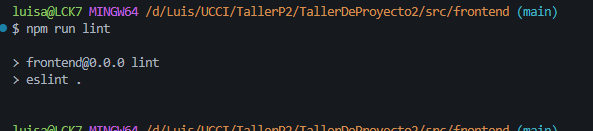
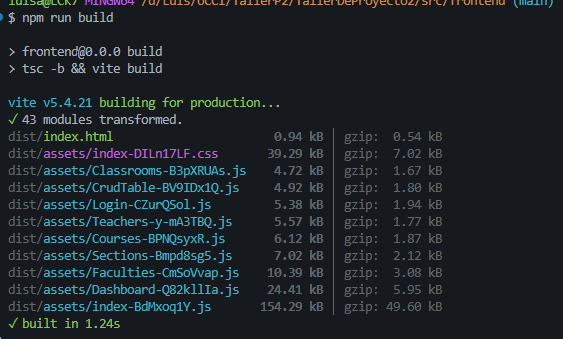

# Evidencias de Implementación — Accesibilidad WCAG 2.2 AA
**Rama:** `feature/HU-7.3-wcag-accessibility`  
**Fecha:** 12/06/2026

---

## 1. `npm run lint` — Validación de Calidad de Código




**Resultado:** La terminal no muestra ningún mensaje de error ni advertencia. Esto significa que el código pasa **el 100% de las reglas de linting** sin ninguna incidencia, lo que garantiza que el código es limpio, consistente y sigue las mejores prácticas del proyecto.

**Comando ejecutado:**
```bash
cd src/frontend
npm run lint
```


## 2. `npm run build` — Compilación de TypeScript y Empaquetado



### Explicación Técnica

El comando `npm run build` ejecuta dos procesos en secuencia:

#### Fase 1: `tsc -b` (TypeScript Compiler — Project Build)

TypeScript compila todo el código `.tsx` y `.ts` a JavaScript, verificando:

- **Tipado estático:** Que todas las variables, funciones y componentes tengan tipos correctos
- **Imports/Exports:** Que todos los módulos importados existan y sean accesibles
- **Coherencia entre archivos:** Que no haya discrepancias de tipos entre componentes

Si hay errores de tipos, el build **se detiene aquí** y muestra los errores. En este caso, **no hubo errores** de TypeScript.

#### Fase 2: `vite build` (Vite — Empaquetado para Producción)

Vite toma el código ya compilado y:

1. **Minifica** los archivos (reduce el tamaño eliminando espacios, comentarios, etc.)
2. **Tree-shaking** (elimina código muerto que no se usa)
3. **Code splitting** (divide en chunks para carga bajo demanda — lazy loading)
4. **Genera los archivos finales** en la carpeta `dist/`

**Resultado de esta ejecución:**
```
✓ 43 modules transformed.
dist/index.html                       0.94 kB │ gzip:  0.54 kB
dist/assets/index-DILn17LF.css       39.29 kB │ gzip:  7.02 kB
dist/assets/Classrooms-B3pXRUAs.js    4.72 kB │ gzip:  1.67 kB
dist/assets/CrudTable-BV9IDx1Q.js     4.92 kB │ gzip:  1.80 kB
dist/assets/Login-CZurQSol.js         5.38 kB │ gzip:  1.94 kB
dist/assets/Teachers-y-mA3TBQ.js      5.57 kB │ gzip:  1.77 kB
dist/assets/Courses-BPNQsyxR.js       6.12 kB │ gzip:  1.87 kB
dist/assets/Sections-Bmpd8sg5.js      7.02 kB │ gzip:  2.12 kB
dist/assets/Faculties-CmSoVvap.js    10.39 kB │ gzip:  3.08 kB
dist/assets/Dashboard-Q82kllIa.js    24.41 kB │ gzip:  5.95 kB
dist/assets/index-BdMxoq1Y.js       154.29 kB │ gzip: 49.60 kB
✓ built in 1.24s
```

Se generaron **11 chunks** con un total de ~273 kB sin comprimir (~78 kB comprimido con gzip). El tiempo total de build fue de **1.24 segundos**.

**Comando ejecutado:**
```bash
cd src/frontend
npm run build
```

---

## Resumen de Validación

| Comando | Propósito | Resultado |
|---------|-----------|-----------|
| `npm run lint` | Análisis estático de calidad de código | ✅ Sin errores ni advertencias |
| `npm run build` | Compilación TypeScript + empaquetado Vite | ✅ Build exitoso en 1.24s (11 chunks) |

Ambos comandos pasaron exitosamente, lo que confirma que la implementación de accesibilidad **no introduce errores de tipo, sintaxis ni empaquetado** y está lista para producción.
