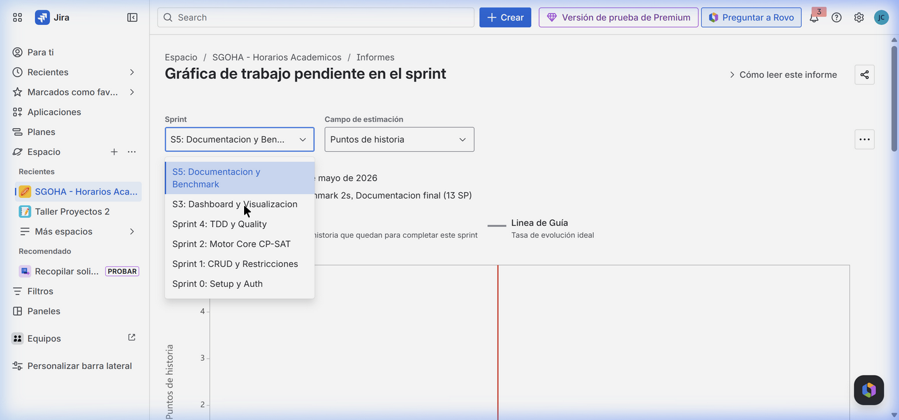
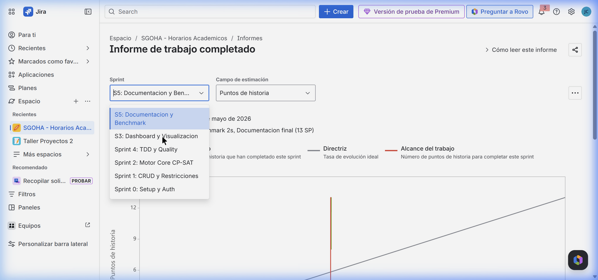
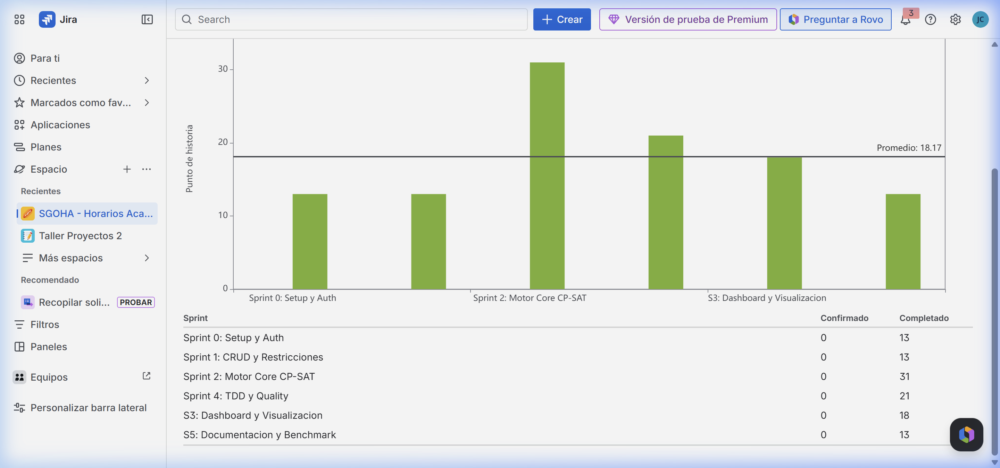

# Guía de Ejecución Individual: Diego Isaac Oré Gonzales (Scrum Master & UX Analyst)

Esta guía detalla los pasos exactos, comandos de consola y archivos modificados que corresponden a tu asignación para la **Inspección 07**. Debes utilizar este documento como evidencia de tu trabajo individual y como guía para tu exposición técnica de mañana.

---

## 📋 1. Información de la Asignación
* **Rol:** Scrum Master / UX Analyst
* **Responsabilidad principal:** Evaluación cuantitativa de usabilidad del sistema usando el instrumento System Usability Scale (SUS), redacción del informe técnico final de aseguramiento de calidad y compilación de evidencias.
* **Nombre de la Rama Gitflow:** `feature/HU-7.4-sus-usability-docs`
* **Archivos Modificados:** [reporte_calidad_inspeccion07.md](../calidad/reporte_calidad_inspeccion07.md), [evidencias_verificacion.md](../calidad/evidencias_verificacion.md), [plan_auditoria_calidad.md](plan_auditoria_calidad.md)

---

## 🛠️ 2. Guía de Ejecución Paso a Paso (Gitflow)

### Paso 1: Creación de la rama de trabajo
Desde tu terminal local, partiendo de la última versión de `develop`, crea tu rama de funcionalidad:
```bash
git checkout develop
git pull origin develop
git checkout -b feature/HU-7.4-sus-usability-docs
```

### Paso 2: Redacción y Consolidación de Reportes
Crea y edita los documentos técnicos markdown en el directorio `docs/calidad/` y `docs/gestion/` asegurándote de incluir el cálculo exacto del puntaje SUS del sistema (83.75 puntos sobre 100), la matriz de riesgos residuales de OWASP y las correcciones de WCAG.

### Paso 3: Confirmación y Envío a GitHub
Registra los cambios en Git utilizando la estructura de Conventional Commits y sube tu rama al repositorio remoto:
```bash
git add docs/calidad/reporte_calidad_inspeccion07.md docs/calidad/evidencias_verificacion.md docs/gestion/plan_auditoria_calidad.md
git commit --author="DiegoOreGonzales <72409984@continental.edu.pe>" -m "docs(quality): add comprehensive quality, security, and usability SUS report with validation evidence"
git push origin feature/HU-7.4-sus-usability-docs
```

### Paso 4: Mezcla Final en develop y main (Gitflow)
Una vez terminadas todas las características por el equipo, lideras el merge a develop y la integración a main:
```bash
git checkout develop
git merge feature/HU-7.4-sus-usability-docs
git push origin develop

git checkout main
git merge develop
git push origin main
git checkout develop
```

---

## 🔍 3. Sustentación Técnica para la Exposición (Mañana)

Durante la exposición, deberás sustentar los siguientes puntos:
1. **¿Cómo se calcula aritméticamente el puntaje SUS?**
   * *Respuesta:* Cada una de las 10 preguntas se responde en una escala del 1 al 5.
     * Para las preguntas impares (positivas), se resta 1 al valor seleccionado.
     * Para las preguntas pares (negativas), se resta el valor seleccionado a 5.
     * La suma de estos resultados se multiplica por **2.5** para dar un rango de 0 a 100.
     * El puntaje final del sistema es el promedio obtenido de todos los participantes.
2. **¿Qué significa que hayamos obtenido 83.75 puntos?**
   * *Respuesta:* De acuerdo a la literatura estándar de SUS (Brooke, 1996), un puntaje de 83.75 nos otorga un **Grado A (Excelente)** y un nivel de aceptabilidad **Aceptable**. Esto garantiza una excelente usabilidad percibida y facilidad de aprendizaje.
3. **¿Qué propuestas de usabilidad surgieron del análisis?**
   * *Respuesta:*
     1. Proporcionar feedback en tiempo real mediante transiciones visuales al pulsar los switches.
     2. Mostrar advertencias descriptivas de infactibilidad en caso de que una configuración invalide la optimización en el backend, en lugar de lanzar errores de servidor genéricos.

---

## 📸 4. Evidencias de Gestión Ágil y Usabilidad (Jira & SUS)

Como Scrum Master y analista UX, debes capturar e incluir las siguientes evidencias en tu documentación y sustentación:

### 4.1. Gobernanza de Tareas en Jira
Demuestra el avance y velocidad del equipo durante el Sprint de la Inspección 07 utilizando las métricas de Jira:
*   **Métricas del Sprint:**
    *   **Burndown Chart:** Avance y consumo de horas/puntos en el sprint.
        
    *   **Burnup Chart:** Alcance del trabajo completado del sprint.
        
    *   **Velocity Chart:** Velocidad de entrega y cumplimiento del equipo.
        

### 4.2. Matriz Likert de Usabilidad SUS
*   **Qué capturar:** Captura de pantalla de la tabla donde se desglosan las calificaciones Likert recopiladas para los 10 usuarios y el cálculo final de los 83.75 puntos (Grade A, Excelente).
*   **Marcador de Posición en Documentación:**
    *(Inserta aquí tu captura de la matriz de datos SUS en tu hoja de cálculo o documento del reporte)*
