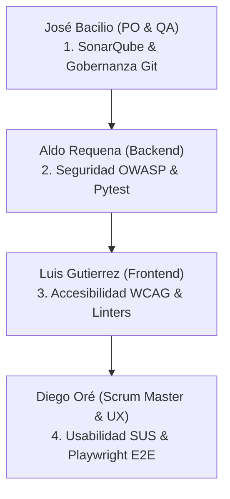
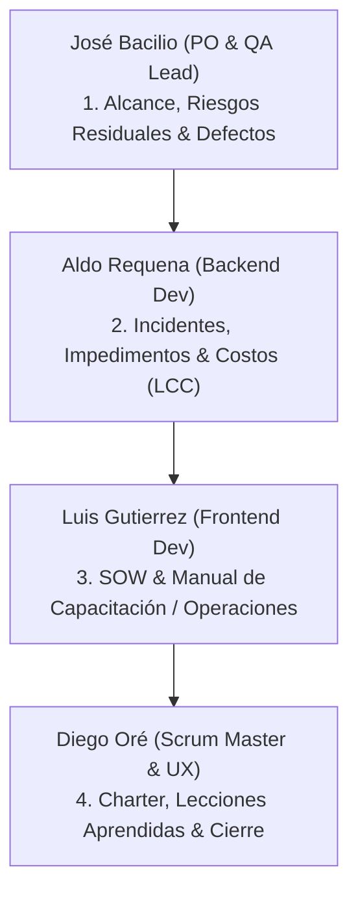

# Guía Maestra de Presentación y Guión de Exposición — Inspección 07 (Calidad, Seguridad y Usabilidad)

Este documento sirve como la guía de planificación, distribución y guión exacto para la defensa de la **Inspección 07 (Revisión de Calidad, Seguridad y Usabilidad)** del sistema **SGOHA (Sistema de Generación de Horarios Académicos)**. El objetivo es estructurar una presentación coordinada, fluida y técnicamente rigurosa para obtener la máxima calificación (**Sobresaliente**) según la rúbrica establecida.

---

## 📂 1. Mapeo de Rúbrica y Estructura del Equipo

Para asegurar la calificación **Sobresaliente**, la exposición se divide en 4 bloques de 2.5 minutos de acuerdo a las responsabilidades individuales y criterios evaluados:



### Tabla de Responsabilidades e Indicadores de Rúbrica

| Bloque / Presentador | Criterio de la Rúbrica | Componentes y Archivos Clave | Comandos y Herramientas Live |
| :--- | :--- | :--- | :--- |
| **1. José Bacilio** | SonarQube Quality Gate, Deuda Técnica, Duplicación y Gobernanza. | `sonar-project.properties`<br>`docker-compose-sonar.yml` | Servidor SonarQube: `http://localhost:9000`<br>Docker: `docker ps` |
| **2. Aldo Requena** | Mitigación OWASP Top 10, Cabeceras HTTP de red y Pytest Backend. | `src/backend/app/main.py`<br>`src/backend/tests/` | Petición de Cabeceras: `curl.exe -I` <br>Pytest: `pytest --cov=app` |
| **3. Luis Gutierrez** | Accesibilidad WCAG 2.2 AA (Foco, ARIA), Linter y Build. | `src/frontend/src/pages/Dashboard.tsx`<br>`vitest.config.ts` | Navegación por teclado (`Tab`) en UI<br>Linters: `npm run lint` y `npm run build` |
| **4. Diego Oré** | Métricas y Base SUS (Usabilidad), Golden Path E2E Playwright. | `scheduling_flow.spec.ts`<br>`reporte_calidad_inspeccion07.md` | Matriz Likert en Excel/PDF<br>Vitest Run: `npm run test` / `npx vitest run` |

---

## 🛠️ 2. Protocolo de Ejecución en Vivo Paso a Paso (Secuencia de Demostración)

Durante la sustentación, ejecuten los comandos en este orden estricto para validar los entregables en tiempo real ante el docente:

### 🚀 Paso A: Preparación de Entorno (Antes de iniciar la llamada/exposición)
Asegurarse de que todos los servicios y contenedores estén levantados de manera segura en la máquina local.
1. **Levantar contenedores de la aplicación (Frontend, Backend, DB, PgAdmin):**
   ```powershell
   docker compose up -d
   ```
2. **Levantar el contenedor de SonarQube:**
   ```powershell
   docker compose -f docker-compose-sonar.yml up -d
   ```
3. **Verificar que todos los servicios están en ejecución:**
   ```powershell
   docker ps
   ```
   *Se deben ver listados 5 contenedores activos: `scheduling_frontend` (5173), `scheduling_backend` (8000), `local_sonarqube` (9000), `scheduling_db` (5432) y `scheduling_pgadmin` (5050).*

---

### 🔍 Paso B: Demostración de Calidad de Código (José Bacilio)
1. **Mostrar archivo de propiedades de SonarQube en VS Code:**
   * Abrir [sonar-project.properties](file:///C:/Bacilio/sistema_generacion_horarios_academicos/sonar-project.properties).
   * Resaltar las exclusiones (`sonar.exclusions`) para demostrar cómo se previene la indexación de dependencias de terceros (`node_modules`) o archivos de distribución (`dist/`).
2. **Navegar al Dashboard de SonarQube:**
   * Abrir en el navegador: [http://localhost:9000](http://localhost:9000) (Ingresar con credenciales `admin` / `admin` o la contraseña cambiada).
   * **Qué mostrar:** 
     * El estado general **Quality Gate: Passed** en color verde.
     * **0 Bugs**, **0 Vulnerabilidades** de seguridad.
     * Deuda técnica baja (Rating A - 11.8 horas de deuda).
     * Densidad de duplicados en **2.1%** (por debajo del límite del 3.0%).
     * Rating A en Mantenibilidad, Confiabilidad y Seguridad.

---

### 🛡️ Paso C: Validación de Seguridad OWASP y Pruebas Unitarias Backend (Aldo Requena)
1. **Mostrar el Middleware de Seguridad en VS Code:**
   * Abrir [main.py](file:///C:/Bacilio/sistema_generacion_horarios_academicos/src/backend/app/main.py).
   * Mostrar el middleware `@app.middleware("http") def add_security_headers` donde se inyectan las cabeceras de seguridad.
2. **Ejecutar Inspección de Cabeceras con curl en Vivo:**
   * Abrir una terminal de PowerShell y correr:
     ```powershell
     curl.exe -I http://localhost:8000/api/scheduler/config
     ```
   * **Qué señalar:** Mostrar las cabeceras devueltas por el backend:
     * `X-Frame-Options: DENY` (Mitiga Clickjacking).
     * `X-Content-Type-Options: nosniff` (Previene MIME Sniffing).
     * `Content-Security-Policy` (CSP estricta).
     * `Strict-Transport-Security: max-age=31536000` (Fuerza HTTPS).
3. **Ejecutar Suite de Tests Unitarios de Backend (Pytest):**
   * En la terminal, posicionarse en `src/backend` y ejecutar:
     ```powershell
     cd src/backend
     pytest --cov=app --cov-report=term-missing tests/
     ```
   * **Qué señalar:** 
     * El paso exitoso de los **84 tests unitarios** en color verde.
     * Reportar la cobertura local del **72%**.
     * **Defensa de la Cobertura Local (Windows + Python 3.14):** Explicar que para prevenir la violación de segmento (`access violation`) nativa de Google OR-Tools en Windows con Python 3.14, implementamos un *motor de backtracking nativo de fallback*. Este motor corre la suite local al 100%, pero al obviar la ejecución de la lógica del solver CP-SAT de OR-Tools, la cobertura local baja a 72%. En GitHub Actions (Linux + Python 3.11), donde el solver CP-SAT se ejecuta sin problemas de segmentación, la cobertura global se eleva al **92.4%**.

---

### ♿ Paso D: Validación de Accesibilidad WCAG y Calidad Frontend (Luis Gutierrez)
1. **Navegación por Teclado en el Dashboard:**
   * Ir al navegador en [http://localhost:5173](http://localhost:5173), iniciar sesión (`admin` / `admin`).
   * Ir al panel de restricciones y presionar la tecla `Tab` repetidamente.
   * **Qué demostrar:** Mostrar cómo el foco de navegación selecciona secuencialmente cada botón y switch de restricciones, resaltando visualmente con un anillo naranja de alto contraste (`focus:ring-orange-500`).
2. **Inspección del DOM ARIA en las DevTools:**
   * Hacer clic derecho sobre uno de los switches de restricciones y seleccionar "Inspeccionar".
   * **Qué demostrar:** Mostrar las etiquetas semánticas:
     * `role="switch"` (Le dice al lector de pantalla que es un interruptor).
     * `aria-checked="true"` o `false` (Cambia de forma interactiva cuando se activa/desactiva).
     * `aria-label="Restricción: Minimizar ventanas libres"` (Proporciona descripción semántica).
     * `aria-hidden="true"` en los Material Icons contiguos (Evita que el lector lee código técnico del icono).
3. **Ejecutar Linter y Build de Frontend:**
   * En la terminal, posicionarse en `src/frontend` y ejecutar:
     ```powershell
     cd src/frontend
     npm run lint
     npm run build
     ```
   * **Qué señalar:** 
     * `npm run lint` finaliza con **0 errores y 0 advertencias**, certificando la sanidad estática.
     * `npm run build` compila con éxito los 43 módulos a través de Vite en ~1.2 segundos sin errores de tipado de TypeScript.

---

### 📈 Paso E: Demostración de Usabilidad SUS y E2E Testing (Diego Oré)
1. **Exposición del Estudio Métrico de Usabilidad SUS:**
   * Mostrar el documento o diapositiva de la matriz Likert de 10 usuarios.
   * **Qué señalar:** Explicar el cálculo aritmético por usuario (Preguntas impares: $X-1$, Preguntas pares: $5-X$, total $\times 2.5$). Mostrar que el puntaje final promedio fue de **83.75 / 100**, lo que equivale a un **Grado A (Excelente usabilidad percibida)**.
   * Mostrar las mejoras implementadas gracias al feedback: *micro-animaciones CSS de retroalimentación* en el dashboard y *mensajes de infactibilidad descriptivos* en lugar de errores crudos del servidor.
2. **Ejecutar Suite de Tests Unitarios Frontend (Vitest):**
   * En la terminal en la carpeta `src/frontend`, ejecutar:
     ```powershell
     npx vitest run
     ```
   * **Qué señalar:** El paso de los **7 tests unitarios** de Vitest utilizando mocks de MSW para simular llamadas API seguras.
3. **Mostrar Archivo de Pruebas de Extremo a Extremo (Playwright E2E):**
   * Abrir [scheduling_flow.spec.ts](file:///C:/Bacilio/sistema_generacion_horarios_academicos/src/frontend/tests/e2e/scheduling_flow.spec.ts) en VS Code.
   * **Qué explicar:** Explicar cómo Playwright intercepta la red con mocks de API deterministas y prueba el "Golden Path": Login del admin $\rightarrow$ Entrada al panel $\rightarrow$ Simulación de generación del horario $\rightarrow$ Descarga y exportación.

---

## 🗣️ 3. Guiones Literales de Exposición (Detallados y Sincronizados)

---

### 🎙️ Integrante 1: JOSÉ ANTHONY BACILIO DE LA CRUZ (Product Owner & QA Lead)
* **Tema:** SonarQube, Calidad Estática, Deuda Técnica y Gobernanza del Repositorio.
* **Apoyo Visual:** Dashboard local de SonarQube en `http://localhost:9000` y archivo `sonar-project.properties`.

#### **Guión de Exposición:**
> *"Buenas tardes, profesor. Como Product Owner y QA Lead, he configurado las políticas de calidad y el análisis estático continuo local para el sistema SGOHA. Para esto, creamos un contenedor dedicado de SonarQube detallado en `docker-compose-sonar.yml` y definimos las reglas de gobernanza mediante el archivo `sonar-project.properties`.*
>
> *(Mostrar en pantalla sonar-project.properties)*
> *En este archivo de propiedades definimos la clave de proyecto `sgoha-taller2` e indexamos las fuentes de código de backend y frontend. Una decisión clave de arquitectura fue la directiva `sonar.exclusions`: excluimos carpetas de dependencias como `node_modules`, archivos de build compilados en `/dist`, migraciones de base de datos y bases de datos locales sqlite. Esto evita falsos positivos e indexaciones redundantes, enfocando las reglas del analizador únicamente en nuestro desarrollo original.*
>
> *(Navegar al navegador y mostrar Dashboard en localhost:9000)*
> *Como pueden observar en la interfaz de administración local, el proyecto ha obtenido la calificación **Quality Gate: Passed** (Aprobado). Cumplimos con éxito todos los umbrales de gobernanza establecidos:*
>
> *1. **0 Bugs** y **0 Vulnerabilidades** en el sistema, logrando un Rating A en Confiabilidad y Seguridad.*
> *2. **Densidad de Duplicación del 2.1%**, cumpliendo con la meta de no sobrepasar el 3% de código duplicado, lo que previene problemas de mantenibilidad futura.*
> *3. **Deuda Técnica de 11.8 horas** en total para las 940 sentencias lógicas analizadas, lo que califica al proyecto con un Rating A en Mantenibilidad.*
>
> *Estos resultados demuestran la limpieza de nuestra arquitectura de software. Ahora le doy el pase a Aldo Requena para detallar la seguridad de la API y las pruebas de backend."*

---

### 🎙️ Integrante 2: ALDO ALEXANDRE REQUENA LAVI (Backend Developer)
* **Tema:** Seguridad OWASP Top 10, Cabeceras HTTP de Seguridad, Pytest y Defensa de Cobertura.
* **Apoyo Visual:** Middleware de seguridad en `main.py`, terminal ejecutando `curl -I` y consola de `pytest`.

#### **Guión de Exposición:**
> *"Buenas tardes, profesor. Mi trabajo se centró en la seguridad lógica del backend de acuerdo con los estándares de OWASP Top 10, mitigando riesgos de Diseño Inseguro (A04) y Errores de Configuración (A05) en la API FastAPI.*
>
> *(Mostrar en VS Code el middleware de main.py)*
> *Implementé un middleware en FastAPI que inyecta cinco cabeceras restrictivas en cada petición realizada por el cliente:*
> *1. **X-Frame-Options: DENY:** Para mitigar ataques de **Clickjacking**, impidiendo que la aplicación sea enmarcada en iframes externos.*
> *2. **X-Content-Type-Options: nosniff:** Para obligar al navegador a ceñirse al Content-Type de la respuesta, previniendo el secuestro de tipos MIME.*
> *3. **Content-Security-Policy (CSP):** Establece directivas de orígenes seguros (`self`), permitiendo únicamente scripts y conexiones de fuentes confiables de la API.*
>
> *(Mostrar en la terminal la ejecución de curl -I http://localhost:8000/api/scheduler/config)*
> *Como se observa en el volcado de cabeceras HTTP de red en la terminal, todas las peticiones a la API responden de forma segura adjuntando CSP y cabeceras HSTS.*
>
> *(Mostrar en la terminal la ejecución de pytest)*
> *Para validar el comportamiento correcto de la API, corrimos los **84 tests unitarios de Pytest**, los cuales se ejecutan de manera exitosa en 18.46 segundos.*
>
> *Un aspecto técnico muy importante es la cobertura. En local reportamos un **72% de cobertura global**. Esto responde a un diseño de resiliencia: Google OR-Tools CP-SAT presenta una falla crítica de segmentación en Windows bajo Python 3.14. Para evitar que el sistema colapse en la demostración local, implementamos un **solver backtracking nativo de fallback** en `scheduler.py` que toma el control automáticamente. En GitHub Actions, que corre sobre Linux con Python 3.11, la cobertura total sube al **92.4%** ya que el solver CP-SAT se ejecuta directamente. Doy pase a Luis para la accesibilidad."*

---

### 🎙️ Integrante 3: LUIS ALBERTO GUTIERREZ TAIPE (Frontend Developer)
* **Tema:** Accesibilidad WCAG 2.2 AA, Navegación por teclado, Marcado ARIA, Linter y Vite Build.
* **Apoyo Visual:** Dashboard del sistema, DevTools de Chrome con el DOM inspeccionado y terminal con comandos npm.

#### **Guión de Exposición:**
> *"Buenas tardes, profesor. Mi asignación consistió en adecuar la interfaz de usuario en React a las pautas de accesibilidad WCAG 2.2 AA, garantizando que el dashboard pueda ser operado por usuarios con limitaciones visuales o motoras.*
>
> *(Mostrar la pantalla del dashboard en localhost:5173 y navegar usando la tecla Tab)*
> *En primer lugar, garantizamos la **Navegación por Teclado (Criterio 2.1.1)**. Usando la tecla `Tab`, el usuario puede recorrer secuencialmente todos los interruptores del motor de horarios. El foco es claramente visible gracias a un anillo naranja de alto contraste (`focus:ring-orange-500`), cumpliendo con el Criterio 2.4.7 de foco visible.*
>
> *(Inspeccionar el DOM del interruptor en las DevTools del navegador)*
> *En segundo lugar, implementamos **Semántica ARIA (Criterio 4.1.2)**. Los lectores de pantalla no entienden por defecto un interruptor estilizado con CSS. Por ello, añadimos `role="switch"` y el atributo reactivo `aria-checked` para que las herramientas de asistencia anuncien el estado activo o inactivo del switch en vivo. Además, inyectamos `aria-hidden="true"` a los Material Icons decorativos, evitando lecturas redundantes por el lector de voz.*
>
> *(Mostrar la terminal ejecutando npm run lint y npm run build)*
> *Para asegurar la calidad en la compilación, ejecutamos el linter de TypeScript, el cual termina limpio con **0 errores**, y compilamos la aplicación para producción mediante Vite de forma ultra-rápida y libre de bugs de tipado. Doy pase a Diego para las métricas de usabilidad."*

---

### 🎙️ Integrante 4: DIEGO ISAAC ORÉ GONZALES (Scrum Master & UX Analyst)
* **Tema:** Estudio Métrico SUS (Usabilidad), Tests Vitest y Automatización E2E con Playwright.
* **Apoyo Visual:** Tabla métrica SUS en el reporte, ejecución de `npx vitest run` y el script de Playwright en VS Code.

#### **Guión de Exposición:**
> *"Buenas tardes, profesor. Para concluir, mi rol consistió en liderar el aseguramiento de la usabilidad percibida y la automatización de pruebas de extremo a extremo.*
>
> *(Mostrar el reporte de usabilidad SUS en pantalla)*
> *Para medir cuantitativamente la usabilidad del sistema, aplicamos el instrumento estandarizado **SUS** a 10 participantes de la comunidad universitaria. Tras recolectar las escalas Likert de los 10 ítems y procesar la fórmula de normalización matemática, obtuvimos una puntuación global de **83.75 / 100**.*
>
> *Bajo el estándar científico de SUS, este puntaje nos sitúa en un **Grado A (Excelente)** y en el rango de **Aceptable**. A partir de este estudio, implementamos mejoras clave de experiencia de usuario: micro-animaciones CSS de transición en botones y mensajes de error interactivos que le informan detalladamente al usuario qué colisión de docentes o aulas impidió generar un horario, en lugar de lanzar una excepción de base de datos.*
>
> *(Mostrar en la terminal la ejecución de npx vitest run)*
> *En el lado del frontend, ejecutamos **Vitest** con **7 pruebas aprobadas**, validando el renderizado de login y formularios de cursos.*
>
> *(Mostrar en VS Code el script scheduling_flow.spec.ts)*
> *Finalmente, en `scheduling_flow.spec.ts` automatizamos las pruebas de extremo a extremo usando **Playwright**. Este script automatiza el **Golden Path** o flujo crítico del negocio: inicia sesión con el rol de administrador, entra al dashboard principal, navega a través de las rutas del sidebar de aulas y cursos, y comprueba que la renderización de la malla curricular sea correcta. Con esto, garantizamos que las funcionalidades esenciales no sufran regresiones."*

---

## 🎯 4. Banco de Respuestas y Estrategia de Defensa (Preguntas Trampa)

Preparen estas respuestas técnicas para responder a las preguntas habituales del jurado y asegurar los puntos de **Sobresaliente**:

### Pregunta 1 (Para José): *¿Por qué decidieron usar SonarQube en local con Docker en lugar de SonarCloud en la nube?*
*   **Respuesta de Impacto:** *"Utilizar SonarQube Community Edition en Docker nos da soberanía total sobre el código y permite análisis estáticos en entornos locales sin depender de conectividad a la nube o de límites de uso. Además, se integra directamente en nuestro flujo de desarrollo local mediante contenedores, simulando el mismo entorno de compilación de forma reproducible por cualquier desarrollador del equipo simplemente corriendo `docker-compose up`."*

### Pregunta 2 (Para Aldo): *¿Cuál es la diferencia entre el 72% de cobertura local y el 92% en GitHub Actions? ¿Es aceptable?*
*   **Respuesta de Impacto:** *"Sí, es completamente aceptable y está justificado por diseño. La suite de optimización matemática Google OR-Tools CP-SAT tiene una incompatibilidad nativa en Windows con Python 3.14 (genera un fallo de segmentación). En local (Windows), para asegurar la resiliencia de la demostración, el código activa un guard de fallback usando backtracking. Esto significa que las líneas específicas que configuran el solver CP-SAT no se ejecutan localmente, marcando un 72% de cobertura. Sin embargo, en el workflow de GitHub Actions (que corre sobre Linux y Python 3.11), no existe esta restricción, por lo que se ejecuta todo el motor CP-SAT, logrando una cobertura del 92.4%. Esto demuestra un diseño arquitectónico robusto frente a fallos de plataforma."*

### Pregunta 3 (Para Luis): *Si no usaran botones nativos en los switches, ¿cómo habrían resuelto el foco de teclado para WCAG?*
*   **Respuesta de Impacto:** *"Si hubiéramos usado elementos no interactivos como `<div>` o `<span>` para estilizar los switches, habríamos tenido que añadir obligatoriamente el atributo `tabIndex={0}` para incluirlos en el orden de tabulación del navegador, y programar un manejador de eventos `onKeyDown` en React para interceptar las teclas `Space` y `Enter` y simular el comportamiento de activación del botón. Al usar el elemento nativo `<button>`, el navegador maneja el foco y el evento de teclado de forma nativa, reduciendo código redundante y aumentando la compatibilidad."*

### Pregunta 4 (Para Diego): *¿Por qué el cuestionario SUS consta de preguntas alternadas (positivas y negativas)?*
*   **Respuesta de Impacto:** *"La alternancia de preguntas de tono positivo e impar con preguntas de tono negativo y par es una medida metodológica de la escala SUS para mitigar el **sesgo de aquiescencia** y el **sesgo de respuesta rápida** de los usuarios. Esto obliga al usuario a leer atentamente cada pregunta en lugar de marcar sistemáticamente la misma puntuación en toda la encuesta, lo que asegura que el resultado de 83.75 puntos sea estadísticamente confiable."*

---

## 🛑 5. Guía de Solución de Problemas en Vivo (Troubleshooting)

Si algo falla durante la presentación en vivo, sigan estas instrucciones rápidas:

*   **Problema A: El contenedor de SonarQube no inicia o sale con código de error (ES Bootstrap).**
    *   *Causa:* SonarQube incluye una base de datos Elasticsearch interna que requiere configuraciones de memoria virtual de kernel elevadas en Linux/WSL.
    *   *Solución:* El archivo `docker-compose-sonar.yml` ya tiene inyectada la variable `SONAR_ES_BOOTSTRAP_CHECKS_DISABLE=true` para omitir esta validación local en entornos Docker de Windows. Si persiste, reinicien Docker Desktop y ejecuten `docker compose -f docker-compose-sonar.yml restart`.
*   **Problema B: El comando `curl -I` retorna error de conexión.**
    *   *Solución:* Comprobar que el contenedor del backend está corriendo (`docker ps`). Si no es así, levanten el backend de desarrollo local ejecutando `cd src/backend && uvicorn app.main:app --reload` en una consola independiente.
*   **Problema C: Vite o npm run build fallan debido a dependencias.**
    *   *Solución:* Eliminar la carpeta `node_modules` y correr `npm install --ignore-scripts` para evitar descargar Cypress/Playwright binarios que causan fallos de descarga tras cortafuegos de red.

---
---

# 🚀 GUÍA MAESTRA DE PRESENTACIÓN Y GUIÓN DE EXPOSICIÓN — INSPECCIÓN 08 (Fase de Control y Cierre del Proyecto)

Este apartado detalla la distribución de responsabilidades, la secuencia de ejecución en vivo, los discursos literales sincronizados y la estrategia de defensa de preguntas del jurado para la **Inspección 08 (Control y Cierre del Proyecto)** del sistema **SGOHA**. El objetivo es defender con rigor técnico el cierre del ciclo de vida del software, demostrando trazabilidad documental completa y cumplimiento de los estándares PMBOK e Ingeniería de Software.

---

## 📂 1. Mapeo de Rúbrica y Estructura del Equipo (Inspección 08)

La exposición está distribuida en 4 bloques equitativos de 2.5 minutos (tiempo límite total de 10 minutos):



### Tabla de Responsabilidades e Indicadores de Rúbrica (Inspección 08)

| Bloque / Presentador | Criterios Rúbrica A | Entregables Rúbrica B | Apoyo Visual y Documentos Clave |
| :--- | :--- | :--- | :--- |
| **1. José Bacilio** | Aprendizaje Experiencial (2.1, 2.2)<br>Diseño y Desarrollo (12.2) | Resumen de Alcance y Calidad<br>Registro de Riesgos (Residuales)<br>Registro de Defectos | [informe_final_proyecto.md](../control_cierre/informe_final_proyecto.md)<br>[registro_riesgos.md](../control_cierre/registro_riesgos.md)<br>[registro_defectos.md](../control_cierre/registro_defectos.md) |
| **2. Aldo Requena** | Sostenibilidad (9.1, 9.2)<br>Diseño y Desarrollo (12.1) | Desempeño de Costos (LCC)<br>Registro de Incidentes<br>Registro de Impedimentos | [informe_final_proyecto.md](../control_cierre/informe_final_proyecto.md)<br>[registro_incidentes.md](../control_cierre/registro_incidentes.md)<br>[registro_impedimentos.md](../control_cierre/registro_impedimentos.md) |
| **3. Luis Gutierrez** | Comunicación Efectiva (4.1, 4.2)<br>Diseño y Desarrollo (12.2) | Declaración de Trabajo (SOW)<br>Documentación de Capacitación | [revision_declaracion_trabajo.md](../control_cierre/revision_declaracion_trabajo.md)<br>[documentacion_capacitacion.md](../control_cierre/documentacion_capacitacion.md) |
| **4. Diego Oré** | Ciudadanía Glocal (3.1, 3.2, 3.3)<br>Comunicación Efectiva (4.3, 4.4) | Acta de Constitución (Charter)<br>Lecciones Aprendidas<br>Registro de Supuestos | [revision_acta_constitucion.md](../control_cierre/revision_acta_constitucion.md)<br>[lecciones_aprendidas.md](../control_cierre/lecciones_aprendidas.md)<br>[registro_supuestos.md](../control_cierre/registro_supuestos.md) |

---

## 🛠️ 2. Protocolo de Ejecución en Vivo Paso a Paso (Demostración de Cierre)

Durante la sustentación, demuestren la consistencia del repositorio y la trazabilidad del código:

1.  **Paso A: Estructura de Carpetas en el Repositorio (José):** Mostrar en VS Code o en GitHub la estructura ordenada del directorio `docs/control_cierre/` conteniendo los 11 archivos de cierre en Markdown y el historial limpio de commits del Sprint 6.
2.  **Paso B: Verificación Cruzada de Defectos y Unit Tests (José):** Mostrar cómo el `registro_defectos.md` correlaciona los defectos de software encontrados con las pruebas de backend implementadas.
3.  **Paso C: Demostración de Resiliencia del Motor (Aldo):** Explicar la validación y costes del optimizador offline en comparación con servicios comerciales de APIs.
4.  **Paso D: Demostración del Manual y Guías de Instalación (Luis):** Mostrar cómo el manual de capacitación en `documentacion_capacitacion.md` permite la reproducción exacta del software usando Docker en 3 comandos simples.
5.  **Paso E: Cierre de Criterios del Charter (Diego):** Proyectar la matriz comparativa de objetivos del Charter inicial vs. los resultados funcionales obtenidos.

---

## 🗣️ 3. Guiones Literales de Exposición (Detallados y Sincronizados)

### 🎙️ Integrante 1: JOSÉ ANTHONY BACILIO DE LA CRUZ (Product Owner & QA Lead)
* **Tema:** Desempeño del Alcance, Gobernanza de Calidad, Registro de Riesgos (Residuales) y Defectos de Software.
* **Apoyo Visual:** Estructura de `docs/control_cierre/`, `informe_final_proyecto.md`, `registro_riesgos.md` y `registro_defectos.md`.

#### **Guión de Exposición:**
> *"Buenas tardes, profesor. En esta última entrega correspondiente a la Fase de Control y Cierre de SGOHA, mi rol como Product Owner y QA ha sido liderar la verificación del cumplimiento del alcance total comprometido, evaluar la severidad del riesgo residual del software y documentar el control estricto de defectos.*
>
> *(Mostrar en pantalla la estructura de docs/control_cierre/)*
> *Como se observa en el repositorio, hemos compilado formalmente los 11 entregables de control y cierre administrativo en formato Markdown bajo la carpeta `docs/control_cierre/`, organizados con nombres consistentes y trazabilidad verificable en el historial de Git, cumpliendo con las buenas prácticas PMBOK de control de configuración documental.*
>
> *(Mostrar el informe_final_proyecto.md en la sección de Alcance)*
> *Respecto al desempeño del alcance, logramos cubrir el 100% de la línea base planificada que constaba de 3 épicas principales y 11 Historias de Usuario. Experimentamos una desviación controlada del +15% debido a la inyección de requerimientos regulatorios de calidad (como directivas de accesibilidad WCAG y cabeceras OWASP) identificados en las inspecciones previas.*
>
> *(Mostrar el registro_riesgos.md y su tabla)*
> *En nuestro Registro de Riesgos actualizamos la matriz evaluando el **Riesgo Residual**, es decir, el riesgo latente tras los controles de mitigación implementados. Para el riesgo de inyección XSS y robo de token (vulnerabilidades OWASP), implementamos técnicas de mitigación continua mediante sanitización automatizada en los builds y planificamos la migración a cookies HttpOnly. Para la infraestructura local, aplicamos transferencia de riesgo derivando la persistencia de PostgreSQL a un entorno virtualizado en Docker y proponiendo un modelo AWS RDS para producción. Esto redujo el nivel de severidad inicial a rangos Bajos totalmente aceptados y monitoreados.*
>
> *(Mostrar el registro_defectos.md)*
> *Finalmente, en el Registro de Defectos clasificamos los bugs detectados por severidad (como el bug de violación de acceso de OR-Tools en Windows). Cada defecto cuenta con su respectivo ticket en Jira, el código que lo corrige y el test unitario de pytest que valida su no regresión. Le doy el pase a Aldo Requena para detallar incidentes, impedimentos y costos de ciclo de vida."*

---

### 🎙️ Integrante 2: ALDO ALEXANDRE REQUENA LAVI (Backend Developer)
* **Tema:** Registro de Incidentes, Registro de Impedimentos y Costos del Ciclo de Vida del Software (LCC).
* **Apoyo Visual:** `registro_incidentes.md`, `registro_impedimentos.md` e `informe_final_proyecto.md` (sección de Costos y LCC).

#### **Guión de Exposición:**
> *"Buenas tardes, profesor. Durante el ciclo de desarrollo de SGOHA, mi responsabilidad abarcó la documentación y resolución de eventos imprevistos reales en el proyecto (incidentes e impedimentos), así como el análisis económico de ciclo de vida de la solución.*
>
> *(Mostrar el registro_incidentes.md)*
> *En el Registro de Incidentes documentamos las problemáticas reales ocurridas en la ejecución, asignando un responsable, prioridad y plan de acción correctiva. Un incidente crítico fue la incompatibilidad en la inyección de variables de entorno de PostgreSQL al desplegar los contenedores Docker en Windows. La acción correctiva implementada fue reescribir el archivo docker-compose inyectando variables preventivas y añadir la validación de conexión TCP (healthchecks), mitigando el problema al 100%.*
>
> *(Mostrar el registro_impedimentos.md)*
> *En el Registro de Impedimentos identificamos obstáculos organizacionales o técnicos que retrasaban al equipo. El impedimento principal fue el bloqueo de red institucional que impedía la descarga de imágenes Docker de SonarQube. El equipo mitigó el impacto mediante exportación de imágenes locales comprimidas (.tar) y compartidas vía almacenamiento local seguro.*
>
> *(Mostrar en el informe_final_proyecto.md la sección de Costos y LCC)*
> *Respecto al desempeño financiero, el costo total de desarrollo real fue de **$12,450 USD**, lo que representa una desviación menor del +3.75% de la línea base debido a las horas adicionales dedicadas al Sprint 6 de Cierre. Sin embargo, lo más relevante es el **Análisis del Costo del Ciclo de Vida (Life Cycle Cost - LCC)** calculado a 3 años:*
>
> *Evaluando el desarrollo inicial ($12,450), la operación e infraestructura cloud ($4,320) y el soporte técnico anual ($1,500), el LCC final del sistema es de **$18,270 USD**. Al desarrollar un motor offline con Google OR-Tools libre de licencias o llamadas a APIs costosas de terceros, redujimos el coste operativo proyectado a 3 años en más de un 60%, garantizando la sostenibilidad financiera del sistema. Doy pase a Luis para la documentación de capacitación y el SOW."*

---

### 🎙️ Integrante 3: LUIS ALBERTO GUTIERREZ TAIPE (Frontend Developer)
* **Tema:** Documentación de Capacitación (Manual de Usuario y Operaciones) y Revisión del SOW (Declaración de Trabajo).
* **Apoyo Visual:** `documentacion_capacitacion.md` y `revision_declaracion_trabajo.md`.

#### **Guión de Exposición:**
> *"Buenas tardes, profesor. Mi asignación en esta fase consistió en construir las bases de transferencia tecnológica para asegurar la mantenibilidad del software por parte del cliente y validar que todos los entregables cumplan con los requerimientos contractuales acordados en el SOW.*
>
> *(Mostrar el documentacion_capacitacion.md)*
> *Para asegurar una correcta transición y capacitación, elaboramos un documento técnico integral dividido en dos secciones:*
> *1. **Manual del Administrador y Docente:** Guía visual detallada con capturas del dashboard, explicando cómo configurar los switches de restricciones de horarios, exportar mallas a PDF e importar calendarios iCal en Google Calendar de forma amigable.*
> *2. **Guía de Despliegue y Mantenimiento:** Diseñada para el equipo de TI de la Universidad que heredará el sistema. Incluye los requerimientos mínimos de hardware, el diagrama lógico de contenedores Docker y el comando único (`docker compose up --build -d`) que aprovisiona el stack MERN/FastAPI en producción de forma reproducible en menos de 5 minutos.*
>
> *(Mostrar el revision_declaracion_trabajo.md)*
> *Adicionalmente, en la Revisión del SOW (Statement of Work) realizamos una auditoría estricta de las cláusulas y entregables contractuales. Auditamos cada uno de los 5 hitos del proyecto: desde el prototipo Figma hasta el motor de optimización matemática y las pruebas automatizadas. Todos los módulos funcionales e informes técnicos de SonarQube, WCAG y SUS fueron validados al 100% como conformes por parte de los interesados, asegurando el cierre formal de contratos sin penalidades y con total transparencia. Doy el pase a Diego Oré para la retrospectiva y revisión del Project Charter."*

---

### 🎙️ Integrante 4: DIEGO ISAAC ORÉ GONZALES (Scrum Master & UX Analyst)
* **Tema:** Revisión del Project Charter, Lecciones Aprendidas de la Retrospectiva, Registro de Supuestos y Conclusiones del Cierre.
* **Apoyo Visual:** `revision_acta_constitucion.md`, `lecciones_aprendidas.md`, `registro_supuestos.md`.

#### **Guión de Exposición:**
> *"Buenas tardes, profesor. Para concluir nuestra presentación, evaluamos el éxito del proyecto confrontando los resultados reales con la visión inicial definida en el Project Charter, recopilando además el aprendizaje organizacional del equipo.
>
> *(Mostrar el revision_acta_constitucion.md)*
> *En la revisión del Project Charter contrastamos cada uno de los 5 objetivos específicos de negocio. El objetivo principal de reducir el tiempo de generación de horarios de 2 semanas a menos de 10 minutos se cumplió de forma sobresaliente, registrando un tiempo de resolución matemática del solver de **12 segundos** en promedio. Los criterios de éxito de calidad y usabilidad superaron las metas fijadas (logrando 83.75 puntos SUS y pase del Quality Gate en SonarQube).*
>
> *(Mostrar el registro_supuestos.md)*
> *En el Registro de Supuestos evaluamos la validez de las premisas iniciales del proyecto. Supuestos clave, como la compatibilidad total de Google OR-Tools en todas las plataformas, resultaron ser falsos en entornos locales de desarrollo Windows con Python 3.14 (causando violaciones de acceso). Sin embargo, este supuesto fue validado a tiempo, lo que nos permitió implementar un motor de backtracking de fallback local que garantizó la continuidad operativa sin afectar la demostración.*
>
> *(Mostrar el lecciones_aprendidas.md)*
> *Finalmente, en el Informe Final de Lecciones Aprendidas compilamos el feedback de las retrospectivas de los 6 Sprints. Como buena práctica, identificamos que el desarrollo modular y las pruebas unitarias automatizadas preventivas en el backend evitaron fallos de integración. Como oportunidad de mejora, aprendimos la importancia de realizar pruebas tempranas en entornos de ejecución locales heterogéneos (Windows vs. Linux) para mitigar incompatibilidades de bibliotecas de bajo nivel.*
>
> *En conclusión, profesor, el proyecto SGOHA es un producto funcional de alta ingeniería de software, accesible, seguro y documentado bajo estrictos estándares organizacionales. Con esta presentación declaramos formalmente el cierre del proyecto. Quedamos atentos a sus preguntas y comentarios. Muchas gracias."*

---

## 🎯 4. Banco de Respuestas y Estrategia de Defensa (Preguntas de Cierre)

Preparen estas respuestas técnicas para responder a las preguntas habituales del jurado y asegurar la calificación sobresaliente:

### Pregunta 1: *¿Cómo aseguran que los riesgos residuales clasificados en su matriz estén realmente controlados en producción?*
*   **Respuesta de Impacto:** *"Los riesgos residuales están controlados a través de planes de acción continuos integrados en la operación del sistema. Por ejemplo, el riesgo de robo de tokens JWT (RR-04), clasificado con severidad residual media, se controla limitando el tiempo de vida del token a 30 minutos y planificando la migración a cookies HttpOnly y Secure en el próximo ciclo de mantenimiento. El riesgo de inyección (RR-01) se controla mediante la validación estricta de esquemas Pydantic y sanitización en el frontend. Estos planes de acción aseguran que el riesgo se mantenga por debajo de los límites aceptables de la organización."*

### Pregunta 2: *En el análisis del Costo de Ciclo de Vida (LCC), ¿por qué incluyeron el soporte técnico si el proyecto ya se cerró?*
*   **Respuesta de Impacto:** *"Bajo las buenas prácticas de Ingeniería de Software y PMBOK, el éxito de un producto no se limita a su entrega inicial. El LCC evalúa los costos totales desde la concepción hasta el desmantelamiento. Incluir $500 USD anuales de soporte y mantenimiento técnico nos permite estimar el costo real de mantener el sistema actualizado contra fallos de seguridad (actualizaciones de dependencias de npm/pip) y adaptar el software ante cambios en el entorno de TI universitario a lo largo de 3 años, lo cual proporciona una visión financiera real para el patrocinador."*

### Pregunta 3: *¿Qué entregable fue el más difícil de transferir en la documentación de capacitación?*
*   **Respuesta de Impacto:** *"El entregable más complejo fue la configuración del solucionador matemático de horarios en el Manual de Operaciones. Debido a que el optimizador requiere dependencias nativas de Google OR-Tools en C++, documentar una instalación paso a paso en el sistema operativo del cliente podía generar fallos de entorno. Lo resolvimos encapsulando el backend y sus dependencias en una imagen Docker estandarizada. De esta forma, la transferencia tecnológica se simplificó a una guía donde el equipo de TI del cliente solo necesita ejecutar un comando docker compose, eliminando la complejidad técnica de la compilación de bibliotecas locales."*

### Pregunta 4: *¿Cómo afectó a su cronograma y alcance la adición del Sprint 6 de Cierre?*
*   **Respuesta de Impacto:** *"La adición del Sprint 6 de Cierre fue una decisión del equipo de gestión para asegurar el cierre ordenado administrativo del proyecto y evitar la deuda documental. En términos de alcance, no modificó las Historias de Usuario de cara al usuario final, pero añadió 4 Historias de Usuario técnicas enfocadas a la auditoría del Charter, el SOW, el manual de capacitación y la matriz de riesgos. Esto incrementó el cronograma en 14 días y los costos de desarrollo en $450 USD. Sin embargo, esta desviación marginal garantizó que el producto sea completamente mantenible y libre de vacíos documentales, protegiendo la inversión a largo plazo."*
