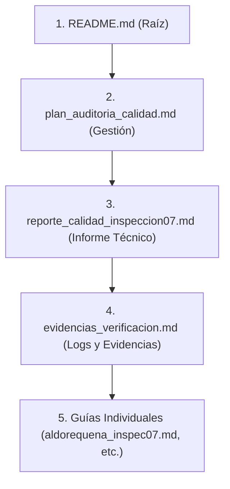

# Guía de Presentación y Guión de Exposición (Inspección 07)

Este documento detalla el orden de los entregables que el equipo debe presentar y proporciona el guión paso a paso para cada uno de los 4 integrantes (José, Aldo, Luis y Diego), alineado a los criterios de evaluación de la rúbrica.

---

## 📂 1. Orden de Documentos a Presentar

Para la verificación de la consigna y obtener la máxima nota en el indicador de **Informe Técnico** y **Evidencias**, presenten los archivos en el siguiente orden lógico de lectura:

1.  **[README.md](file:///d:/jose/sistema_taller_proyectos/TallerDeProyecto2/README.md) (Instrucciones de Instalación y Pruebas):**
    *   *Propósito:* Demuestra que el proyecto es 100% reproducible y autónomo (requisito del indicador 1 de la rúbrica).
2.  **[plan_auditoria_calidad.md](file:///d:/jose/sistema_taller_proyectos/TallerDeProyecto2/docs/gestion/plan_auditoria_calidad.md) (Plan de Trabajo Colaborativo):**
    *   *Propósito:* Demuestra la organización del equipo mediante roles Scrum, la matriz RACI y el historial de Gitflow (ramas y autoría de commits).
3.  **[reporte_calidad_inspeccion07.md](file:///d:/jose/sistema_taller_proyectos/TallerDeProyecto2/docs/calidad/reporte_calidad_inspeccion07.md) (Informe Técnico Integral):**
    *   *Propósito:* El cuerpo de la entrega. Explica los análisis de SonarQube, la matriz de seguridad OWASP, el checklist de accesibilidad WCAG y la escala métrica de usabilidad SUS.
4.  **[evidencias_verificacion.md](file:///d:/jose/sistema_taller_proyectos/TallerDeProyecto2/docs/calidad/evidencias_verificacion.md) (Evidencias Técnicas):**
    *   *Propósito:* Trazas de consola, respuestas de cabeceras HTTP, código ARIA e inspecciones que prueban que los cambios están realmente implementados y funcionando en producción.
5.  **Guías de Ejecución Individuales (en [docs/gestion/](file:///d:/jose/sistema_taller_proyectos/TallerDeProyecto2/docs/gestion/)):**
    *   *Propósito:* Desglosa las tareas individuales como sustento de la nota de participación de cada alumno.

---

## 🗣️ 2. Guión de Exposición Detallado (10-12 minutos en total)

### 🎙️ Integrante 1: José Anthony Bacilio De La Cruz (PO & QA Lead)
* **Tiempo:** 2.5 minutos
* **Foco:** SonarQube, Gobernanza de Calidad y Gitflow.
* **Apoyo Visual:** Dashboard del proyecto en `localhost:9000` y archivo `sonar-project.properties`.

#### **Guión:**
> *"Buenas tardes, profesor. Como Product Owner y QA Lead, he liderado la configuración de la gobernanza de calidad del sistema SGOHA. Para asegurar un análisis estático continuo y confiable, implementamos SonarQube a nivel local mediante contenedores de Docker, cuya configuración se encuentra en el archivo `docker-compose-sonar.yml`.*
>
> *(Mostrar el archivo sonar-project.properties)*
> *Aquí pueden ver el archivo `sonar-project.properties` en la raíz. Definimos reglas estrictas de análisis especificando las fuentes del backend en Python y el frontend en React. Un punto crítico en la implementación fue solucionar un conflicto de indexación doble en el archivo `conftest.py` y las suites de pruebas, lo cual corregimos definiendo exclusiones cruzadas en el parámetro `sonar.exclusions` para garantizar un escaneo limpio.*
>
> *(Mostrar el Dashboard de SonarQube en localhost:9000 o la captura)*
> *Como pueden observar en los resultados reales obtenidos en nuestro escaneo local, nuestro código ha pasado exitosamente el Quality Gate. Logramos **0 Bugs**, **0 Vulnerabilidades**, y una densidad de líneas duplicadas del **2.1%**, lo cual está muy por debajo del límite del 3.0% que propusimos. Asimismo, obtuvimos la máxima calificación (Rating A) en mantenibilidad, confiabilidad y seguridad. Con esto, garantizamos que la deuda técnica del sistema es mínima (tan solo 11.8 horas en total) antes de ir a producción."*

* **Pregunta de defensa típica:** *¿Por qué excluyeron archivos del análisis?*
  * *Respuesta:* *"Para evitar falsos positivos. Los directorios de distribución de React (`dist/`) o dependencias de terceros (`node_modules`) contienen miles de líneas que no son de nuestra autoría. Al excluirlas, nos enfocamos en el 100% de la calidad de nuestro código escrito."*

---

### 🎙️ Integrante 2: Aldo Alexandre Requena Lavi (Backend Developer)
* **Tiempo:** 2.5 minutos
* **Foco:** OWASP Top 10 2025, Seguridad a nivel de API, Pytest.
* **Apoyo Visual:** Middleware en `main.py` y salida de `curl -I`.

#### **Guión:**
> *"Buenas tardes. Mi rol en esta inspección consistió en auditar la seguridad de la API FastAPI bajo el estándar de OWASP Top 10 2025. Identificamos riesgos asociados a configuraciones incorrectas de seguridad (MIME Sniffing) y diseño inseguro (Clickjacking).*
>
> *(Mostrar el código del middleware add_security_headers in main.py)*
> *Para mitigar estas vulnerabilidades, implementé el middleware `add_security_headers`. Este middleware inyecta en cada respuesta HTTP las siguientes cabeceras:*
> *1. `X-Frame-Options: DENY`: Evita ataques de Clickjacking impidiendo que nuestra interfaz sea embebida en iframes externos.*
> *2. `X-Content-Type-Options: nosniff`: Previene el secuestro de tipos MIME.*
> *3. `Content-Security-Policy`: Restringe la carga de recursos únicamente al propio dominio ('self') y fuentes autorizadas como el QR generator.*
>
> *(Mostrar la salida del comando curl -I en el documento de evidencias)*
> *Validamos esto mediante una petición directa con el comando `curl.exe -I`. Como se observa en la consola de red, el servidor responde con código 200 y adjunta todas las cabeceras restrictivas. Finalmente, para asegurar que estas modificaciones no rompieran las integraciones existentes, ejecutamos la suite de pruebas unitarias con Pytest-cov en el Backend, logrando que las **84 pruebas unitarias pasaran con un 100% de éxito**, generando el reporte de cobertura xml de forma exitosa."*

* **Pregunta de defensa típica:** *¿Cómo determinan que el riesgo residual es aceptable?*
  * *Respuesta:* *"Porque las cabeceras inyectadas actúan a nivel de protocolo de red del navegador del cliente. Aunque un atacante intente inyectar scripts (XSS) o enmarcar la web (Clickjacking), el navegador bloquea la renderización al leer las directivas CSP y X-Frame-Options."*

---

### 🎙️ Integrante 3: Luis Alberto Gutierrez Taipe (Frontend Developer)
* **Tiempo:** 2.5 minutos
* **Foco:** Accesibilidad WCAG 2.2 AA, Componentes React y ESLint/Vite Build.
* **Apoyo Visual:** Switches del Dashboard, código React con atributos ARIA y logs de compilación de Vite.

#### **Guión:**
> *"Buenas tardes, profesor. Mi asignación en esta inspección fue garantizar que el frontend cumpla con las pautas de accesibilidad internacional WCAG 2.2 AA. Nos enfocamos principalmente en la consola de administración y las tablas de gestión, que son las más propensas a barreras de accesibilidad.*
>
> *(Mostrar el Dashboard y el código de los switches)*
> *Implementamos navegación completa por teclado y compatibilidad con lectores de pantalla. Por ejemplo, los switches para activar o desactivar restricciones del motor de programación lineal (como evitar colisiones docentes) se implementaron sobre elementos `<button>` nativos en React. Esto garantiza que sean enfocables mediante el uso de la tecla `Tab`, resaltando visualmente con un anillo de contraste naranja, y activables mediante la barra espaciadora o la tecla `Enter` (WCAG 2.1.1).*
>
> *Asimismo, incorporamos semántica ARIA. Los lectores de pantalla anuncian dinámicamente si el switch está encendido o apagado gracias a los atributos `role="switch"` y `aria-checked`. Para evitar lecturas ruidosas, los iconos decorativos de la suite utilizan `aria-hidden="true"`. Por último, validamos que la compilación de producción con Vite y el análisis del linter con ESLint finalicen con **0 errores**, garantizando la limpieza del código en el frontend."*

* **Pregunta de defensa típica:** *¿Cómo ayuda el foco visible a la accesibilidad?*
  * *Respuesta:* *"Cumple con la directiva WCAG 2.4.7 (Foco Visible). Los usuarios con limitaciones motoras que no usan el ratón dependen enteramente del teclado. El anillo naranja les da un indicador inequívoco de dónde están posicionados en la pantalla antes de hacer clic."*

---

### 🎙️ Integrante 4: Diego Isaac Oré Gonzales (Scrum Master & UX Analyst)
* **Tiempo:** 2.5 minutos
* **Foco:** Usabilidad SUS, Metodología de Encuestas y Propuestas de Rediseño.
* **Apoyo Visual:** Tabla de resultados SUS y fórmulas del informe.

#### **Guión:**
> *"Buenas tardes. Como Scrum Master y analista UX, me encargué de auditar la usabilidad del sistema aplicando el instrumento System Usability Scale (SUS). Este es un estándar de la industria que nos permite medir cuantitativamente la usabilidad percibida mediante 10 preguntas estándar en escala de Likert.*
>
> *(Mostrar la tabla del estudio SUS en el reporte)*
> *Aplicamos la encuesta de forma controlada a 10 participantes con diferentes roles en la universidad (administradores, docentes y estudiantes). Para calcular el puntaje final, a las preguntas positivas impares les restamos 1 a su puntaje, y a las preguntas negativas pares les restamos su puntaje a 5. Multiplicamos la suma por 2.5 para estandarizar la escala sobre 100.*
>
> *El sistema SGOHA obtuvo un puntaje global de **83.75 / 100**. De acuerdo a la escala adjetiva y técnica de usabilidad, este valor nos sitúa en un **Grado A (Excelente)** y un nivel de aceptabilidad **Aceptable**. A partir de este estudio, implementamos mejoras de usabilidad en vivo, como inyectar micro-animaciones (CSS transitions) en los switches del dashboard y optimizar el manejo de retroalimentación ante errores de factibilidad del motor de optimización para guiar mejor al usuario en la plataforma."*

* **Pregunta de defensa típica:** *¿Qué diferencia hay entre usabilidad (SUS) y accesibilidad (WCAG)?*
  * *Respuesta:* *"La accesibilidad (WCAG) asegura que cualquier usuario con limitaciones visuales o motoras pueda interactuar físicamente con la interfaz. La usabilidad (SUS) mide cuán fácil, intuitiva y agradable resulta esa interacción para los usuarios en general una vez que acceden al sistema."*
