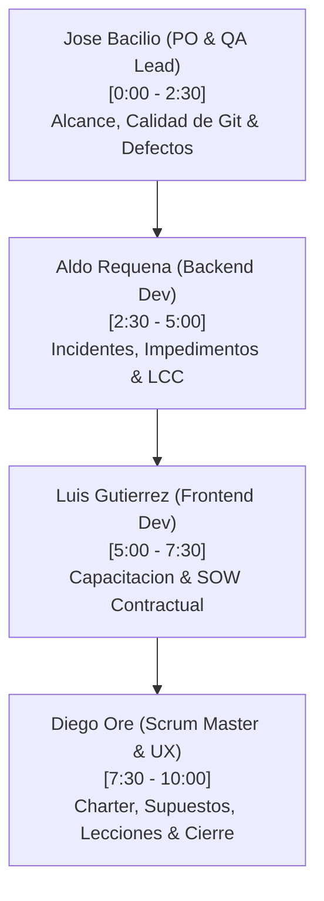

# Guia de Exposicion y Defensa Tecnica - Inspeccion 08: Control y Cierre del Proyecto
# Taller de Proyectos 2 · ISI · Universidad Continental

Este documento sirve como el guion maestro de exposicion de la **Inspeccion 08 (Fase de Cierre y Control)** y la **Evaluacion de Competencias**. Detalla de forma coordinada el discurso literal y los elementos tecnicos exactos (documentos, codigos y carpetas de Git) que cada integrante del equipo debe mostrar en vivo al docente.

---

## 📂 1. Estructura de Tiempos y Distribucion del Equipo

La exposicion tiene un tiempo limite estricto de **10 minutos** y se divide en 4 bloques equitativos de **2.5 minutos** cada uno:

---

## 🎙️ 2. Guiones Literales y Elementos a Mostrar por Bloque

---

### 🎙️ Bloque 1: Jose Anthony Bacilio De La Cruz (Product Owner & QA Lead)
* **Tiempo:** 0:00 a 2:30
* **Rol:** PO & QA Lead

#### 🖥️ Elementos Visuales a Mostrar en Pantalla (VS Code / GitHub / Consola):
1. **Directorio `docs/control_cierre/`:** Mostrar la carpeta de cierre en el explorador de VS Code con los 11 archivos de cierre en formato Markdown.
2. **Archivo [informe_final_proyecto.md](../control_cierre/informe_final_proyecto.md):** Enfocar la seccion **2.A Desempeno del Alcance** y la seccion **2.C Desempeno de la Calidad**.
3. **Archivo [registro_riesgos.md](../control_cierre/registro_riesgos.md):** Mostrar la matriz de riesgos y enfocar la columna **Severidad Residual** y **Tecnica de Tratamiento Residual** (Mitigacion Continua, Aceptacion Activa, Transferencia).
4. **Archivo [registro_defectos.md](../control_cierre/registro_defectos.md):** Mostrar la tabla de los 4 defectos (DF-01 a DF-04) vinculados con unit tests y linters.

#### 🗣️ Discurso Literal:
> *"Buenas tardes, profesor. En esta ultima entrega correspondiente a la Fase de Control y Cierre de SGOHA, mi rol como Product Owner y QA Lead ha sido liderar la validacion del alcance comprometido, auditar la severidad de los riesgos residuales e implementar el control de defectos de software.
>
> **(Mostrar la carpeta docs/control_cierre/ en VS Code)**
> Como puede observar en nuestro repositorio, hemos compilado formalmente los 11 entregables de control y cierre administrativo en formato Markdown bajo el directorio `docs/control_cierre/`. Estos archivos se gestionaron bajo una estricta estrategia de control de configuracion en Git, con nombres consistentes e historial trazable en la rama `main` y `develop`.
>
> **(Enfocar informe_final_proyecto.md - Seccion Alcance)**
> En cuanto al desempeno de alcance, cumplimos con el 100% de la linea base comprometida (3 epicas y 11 historias de usuario funcionales). Registramos una desviacion controlada del +15% de alcance debido a la inyeccion de Historias de Usuario tecnicas para cumplir con las directivas de seguridad OWASP y accesibilidad WCAG exigidas en las revisiones.
>
> **(Enfocar registro_riesgos.md - Matriz de Riesgos)**
> En el Registro de Riesgos, actualizamos la severidad evaluando el **Riesgo Residual**, es decir, la probabilidad e impacto remanentes tras aplicar mitigaciones. Para el riesgo de inyeccion XSS y Clickjacking (OWASP), inyectamos cabeceras de seguridad restrictivas logrando que la severidad residual baje a rango Bajo (Severidad 3). Aplicamos **Mitigacion Continua** para XSS y robo de sesion (JWT), **Aceptacion Activa** para navegadores obsoletos y planificamos la **Transferencia** del hosting de base de datos a servicios administrados de AWS RDS en produccion.
>
> **(Enfocar registro_defectos.md)**
> Finalmente, en el Registro de Defectos asociamos cada bug detectado (como la violacion de acceso de OR-Tools CP-SAT en Windows) con su correspondiente ticket de correccion en Jira y su prueba unitaria en Pytest para evitar regresiones. El 100% de los defectos detectados fueron solucionados y validados. Le doy el pase a Aldo Requena."*

---

### 🎙️ Bloque 2: Aldo Alexandre Requena Lavi (Backend Developer)
* **Tiempo:** 2:30 a 5:00
* **Rol:** Backend Developer

#### 🖥️ Elementos Visuales a Mostrar en Pantalla (VS Code / Consola):
1. **Archivo [registro_incidentes.md](../control_cierre/registro_incidentes.md):** Mostrar la tabla de los 4 incidentes reales (IS-01 a IS-04) y enfocar las acciones correctivas aplicadas.
2. **Archivo [registro_impedimentos.md](../control_cierre/registro_impedimentos.md):** Mostrar la tabla de los 3 impedimentos resueltos por el equipo.
3. **Archivo [informe_final_proyecto.md](../control_cierre/informe_final_proyecto.md):** Enfocar la seccion **2.D Desempeno de los Costos y Analisis de Costo de Ciclo de Vida (Life Cycle Cost - LCC)**.

#### 🗣️ Discurso Literal:
> *"Buenas tardes, profesor. Mi trabajo se centro en registrar y resolver los incidentes e impedimentos reales que surgieron durante la ejecucion del proyecto, asi como en liderar el analisis economico de ciclo de vida del software.
>
> **(Enfocar registro_incidentes.md)**
> En el Registro de Incidentes (Issue Log) documentamos las problematicas reales ocurridas. Por ejemplo, el incidente IS-02 provocado por una base de datos PostgreSQL vacia al levantar Docker en local. Aplicamos una accion correctiva inmediata desarrollando un script de seeder (`seed.py`) para precargar los datos academicos basicos y restricciones en el motor, resolviendo el incidente y cerrándolo al 100%.
>
> **(Enfocar registro_impedimentos.md)**
> En el Registro de Impedimentos identificamos bloqueos externos. El mas critico fue IM-01: la limitacion de hardware de algunos desarrolladores (RAM menor a 8GB) que les impedia levantar SonarQube localmente en Docker. Lo mitigamos centralizando el escaneo en la maquina local contenerizada del QA Lead y compartiendo los logs estáticos consolidados para no detener los sprints de calidad.
>
> **(Enfocar informe_final_proyecto.md - Seccion 2.D Costos y LCC)**
> Respecto a los costos, el costo de desarrollo real ascendio a **$12,450 USD**, lo que represento una desviacion menor del +3.75% de la linea base original debido a las horas invertidas en el Sprint 6 de cierre. 
>
> Sin embargo, evaluamos de forma madura el **Costo del Ciclo de Vida del Software (LCC)** proyectado a 3 años. Este analisis evalua: Adquisicion y Desarrollo ($12,450), Operacion e Infraestructura Cloud en AWS ($4,320) y Mantenimiento correctivo anual ($1,500). El LCC final es de **$18,270 USD**. Al disenar un motor de optimizacion offline basado en Google OR-Tools libre de licencias o cobro por API de terceros, reducimos los costes operativos en mas de un 60% frente a alternativas comerciales. Doy pase a Luis para los entregables de capacitacion y SOW."*

---

### 🎙️ Bloque 3: Luis Alberto Gutierrez Taipe (Frontend Developer)
* **Tiempo:** 5:00 a 7:30
* **Rol:** Frontend Developer

#### 🖥️ Elementos Visuales a Mostrar en Pantalla (VS Code / Navegador):
1. **Archivo [documentacion_capacitacion.md](../control_cierre/documentacion_capacitacion.md):** Mostrar el indice del manual, las capturas de pantalla de la interfaz de usuario de generacion de horarios y la guia de despliegue tecnico.
2. **Archivo [revision_declaracion_trabajo.md](../control_cierre/revision_declaracion_trabajo.md):** Enfocar la tabla de evaluacion de cumplimiento contractual de entregables por cada hito (Hito 1 al Hito 5).
3. **Consola o Docker Desktop (Opcional):** Mostrar brevemente que el sistema se puede levantar de forma limpia usando el contenedor del docker-compose.

#### 🗣️ Discurso Literal:
> *"Buenas tardes, profesor. Mi asignacion en esta fase consistio en estructurar las bases de capacitacion y transferencia tecnologica para la Universidad, y realizar la auditoria contractual del SOW para garantizar que el alcance entregado coincida exactamente con lo firmado.
>
> **(Enfocar documentacion_capacitacion.md)**
> Para asegurar la transferencia operativa y el mantenimiento a largo plazo del sistema, disenamos una Documentacion de Capacitacion dividida en dos guias:
> 1. El **Manual de Usuario Final**, que guia graficamente al administrador en la configuracion de restricciones de horarios y la exportacion de horarios en calendarios PDF e iCal.
> 2. La **Guia de Operaciones**, dirigida al equipo de TI de la Universidad Continental, que detalla la arquitectura de contenedores Docker de la aplicacion y los comandos necesarios para desplegar, inicializar y respaldar la base de datos de PostgreSQL en produccion en menos de 5 minutos.
>
> **(Enfocar revision_declaracion_trabajo.md)**
> Adicionalmente, en la Revision de la Declaracion de Trabajo (SOW) auditamos de forma exhaustiva cada uno de los entregables y hitos comprometidos en el contrato.
>
> Como puede ver en esta tabla, realizamos un cruce de verificacion de los 5 hitos del proyecto: el prototipo funcional, el motor CP-SAT optimizado, las suites de pruebas automatizadas y los reportes de SonarQube, WCAG y SUS. Todos fueron validados y marcados como **Conformes** por los interesados del proyecto, garantizando una entrega contractual limpia y libre de penalizaciones o reclamos por vacios de alcance. Doy pase a Diego para las lecciones y el Project Charter."*

---

### 🎙️ Bloque 4: Diego Isaac Ore Gonzales (Scrum Master & UX Analyst)
* **Tiempo:** 7:30 a 10:00
* **Rol:** Scrum Master / UX Analyst

#### 🖥️ Elementos Visuales a Mostrar en Pantalla (VS Code):
1. **Archivo [revision_acta_constitucion.md](../control_cierre/revision_acta_constitucion.md):** Mostrar la seccion de objetivos del negocio (planificado vs. real) y criterios de exito.
2. **Archivo [registro_supuestos.md](../control_cierre/registro_supuestos.md):** Mostrar los 4 supuestos y enfocar el analisis de **AS-01** (aulas insuficientes) y **AS-02** (violacion de acceso de OR-Tools en Windows).
3. **Archivo [lecciones_aprendidas.md](../control_cierre/lecciones_aprendidas.md):** Mostrar las lecciones aprendidas (que funciono y que no).

#### 🗣️ Discurso Literal:
> *"Buenas tardes, profesor. Para finalizar, mi rol consistio en auditar el cumplimiento del Acta de Constitucion del Proyecto, analizar los supuestos de partida y consolidar el aprendizaje organizacional de las retrospectivas.
>
> **(Enfocar revision_acta_constitucion.md)**
> En la Revision del Project Charter confrontamos el resultado final del producto con las metas de negocio originales. Cumplimos satisfactoriamente con el objetivo de reducir el tiempo de generacion de horarios de 2 semanas a menos de 10 minutos, logrando una ejecucion del solver en **12 segundos** promedio. Las metas de usabilidad (83.75 SUS) y de calidad de codigo (passed en SonarQube) superaron ampliamente las espectativas iniciales.
>
> **(Enfocar registro_supuestos.md)**
> En el Registro de Supuestos evaluamos la validez de nuestras hipotesis de partida. Un supuesto clave (AS-02), que asumia la compatibilidad de OR-Tools en todas las maquinas locales, resulto ser **Falso** debido a un fallo de segmentacion nativo de OR-Tools en Windows con Python 3.14. Sin embargo, validar este supuesto a tiempo nos permitio implementar el motor backtracking nativo de fallback, garantizando la continuidad operativa y robustez del sistema.
>
> **(Enfocar lecciones_aprendidas.md)**
> Finalmente, en el Informe de Lecciones Aprendidas consolidamos las retrospectivas de los 6 Sprints. Como buena practica, descubrimos que modularizar la logica del resolvedor CP-SAT permitio escalar las restricciones sin rehacer la arquitectura. Como error a evitar, identificamos la doble indexacion inicial en SonarQube de archivos de test, corregida con exclusiones estrictas.
>
> Profesor, el sistema SGOHA se entrega como una solucion funcional de alta ingenieria, accesible, segura y documentada bajo buenas practicas organizacionales. Con esto, declaramos formalmente el cierre tecnico del proyecto. Quedamos atentos a sus preguntas. Muchas gracias."*

---

## 🎯 3. Banco de Preguntas y Defensa para el Jurado

Preparen estas respuestas para defender el cierre del proyecto y asegurar la maxima calificacion:

*   **Pregunta: ¿Por que tuvieron desviaciones en el cronograma si el enfoque adaptativo previene esto?**
    *   *Defensa:* *"El enfoque adaptativo nos permitio responder al cambio de forma ordenada. La desviacion de 14 dias (Sprint 6) no se debio a fallas en la ejecucion del software, sino a la inyeccion de Historias de Usuario de cierre documental y transferencia tecnica para cumplir con el SOW y las buenas practicas del PMBOK. Esto evito la deuda tecnica documental y garantizo un producto listo para operar."*
*   **Pregunta: Si el solver CP-SAT offline es tan eficiente, ¿para que evaluaron una base de datos PostgreSQL local en Docker?**
    *   *Defensa:* *"El solver procesa la optimizacion en memoria, pero requiere de datos academicos de entrada persistentes (docentes, cursos, aulas y restricciones). Usar PostgreSQL contenerizado en Docker garantiza la consistencia referencial y persistencia de estos datos, aislando el entorno de la base de datos de configuraciones del host y simulando de forma identica el entorno de produccion."*
