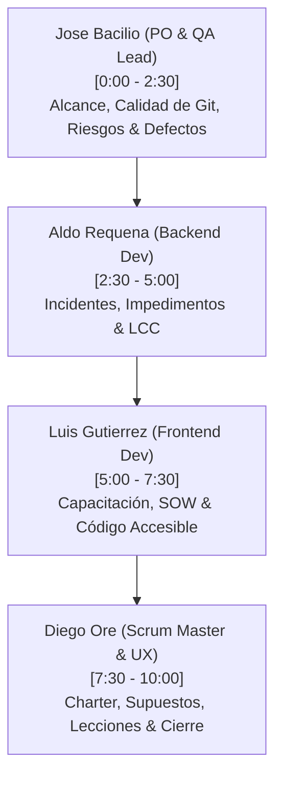

# Guía de Exposición y Defensa Técnica - Inspección 08: Control y Cierre del Proyecto
# Taller de Proyectos 2 · ISI · Universidad Continental

Este documento sirve como el guion maestro de exposición para la **Inspección 08 (Fase de Cierre y Control)** y la **Evaluación de Competencias**. Detalla de forma coordinada el discurso literal, los tiempos estrictos y los elementos técnicos exactos (documentos de cierre, código fuente en VS Code, contenedores Docker y paneles web) que cada integrante del equipo debe mostrar en vivo al docente.

---

## 📂 1. Estructura de Tiempos y Distribución del Equipo

La exposición tiene un tiempo límite estricto de **10 minutos** y se divide en 4 bloques equitativos de **2.5 minutos** cada uno:

---

## 🎙️ 2. Guiones Literales y Elementos a Mostrar por Bloque

---

### 🎙️ Bloque 1: José Anthony Bacilio De La Cruz (Product Owner & QA Lead)
*   **Tiempo:** 0:00 a 2:30
*   **Rol:** Product Owner & QA Lead

#### 🖥️ Elementos Visuales a Mostrar en Pantalla (VS Code / Navegador / SonarQube):
1.  **Explorador de Archivos en VS Code:** Mostrar la carpeta [docs/control_cierre/](../control_cierre/) mostrando los 11 archivos de cierre en formato Markdown.
2.  **Archivo [informe_final_proyecto.md](../control_cierre/informe_final_proyecto.md):** Enfocar la sección **2.A Desempeño del Alcance** (desviación de +15%) y **2.C Desempeño de la Calidad**.
3.  **Archivo [registro_riesgos.md](../control_cierre/registro_riesgos.md):** Enfocar la tabla y los nuevos riesgos **RS-06 (Fuga de Conexiones PostgreSQL)** y **RS-07 (Baja Adopción Docente)**, destacando la columna **Severidad Residual** y **Técnica de Tratamiento**.
4.  **Archivo [registro_defectos.md](../control_cierre/registro_defectos.md):** Mostrar los defectos **DF-05** (fallo de OR-Tools en Windows solucionado con backtracking fallback) y **DF-06** (bloqueo CSP de Tailwind).
5.  **Dashboard Local de SonarQube (Navegador en `http://localhost:9000`):** Mostrar el panel con el estado **Quality Gate: PASSED**, evidenciando 0 Bugs, 0 Vulnerabilities, 0 Security Hotspots y la mantenibilidad general en Rating A.

#### 🗣️ Discurso Literal:
> *"Buenas tardes, profesor. En esta última entrega correspondiente a la Fase de Control y Cierre del proyecto SGOHA, mi rol como Product Owner y QA Lead ha sido auditar el alcance del producto, controlar la mitigación de los riesgos y verificar el cierre del 100% de los defectos de software.
>
> **(Mostrar la carpeta docs/control_cierre/ en el explorador de VS Code)**
> Como puede observar, hemos estructurado e implementado los 11 documentos de control administrativo exigidos, los cuales han sido versionados en Git de manera formal y trazable.
>
> **(Enfocar informe_final_proyecto.md - Secciones 2.A y 2.C)**
> En alcance cumplimos con la línea base original de 3 épicas y 11 historias de usuario. Registramos una desviación controlada del +15% debido a Historias de Usuario técnicas que inyectamos en el Sprint 4 para cumplir con las directivas de seguridad OWASP y accesibilidad WCAG. En calidad, nuestra suite de Pytest alcanzó un **81% de cobertura** y Vitest un **100%**.
>
> **(Enfocar registro_riesgos.md - Fila de RS-06 y RS-07)**
> En nuestro Registro de Riesgos, el control de mitigaciones redujo la severidad original a un rango bajo de riesgo residual. Por ejemplo, en el riesgo técnico **RS-06** sobre fugas de conexión de base de datos, implementamos sesiones generadas con `yield` en FastAPI, reduciendo el riesgo a un nivel residual bajo. Para el riesgo **RS-07** de adopción docente, administramos encuestas cuantitativas de usabilidad.
>
> **(Enfocar registro_defectos.md - DF-05 y DF-06)**
> Finalmente, en el Registro de Defectos, documentamos 8 fallos detectados y corregidos. Destaco el defecto **DF-05** donde el solucionador CP-SAT fallaba nativamente en entornos locales Windows con Python 3.14. Lo solucionamos implementando un motor de backtracking alternativo en Python puro como fallback.
>
> **(Mostrar la pestaña de SonarQube en el navegador)**
> Como evidencia de nuestra calidad estática, aquí está el panel local de SonarQube, mostrando el Quality Gate aprobado y 0 vulnerabilidades en nuestro código. Le doy el pase a Aldo Requena."*

---

### 🎙️ Bloque 2: Aldo Alexandre Requena Lavi (Backend Developer)
*   **Tiempo:** 2:30 a 5:00
*   **Rol:** Backend Developer

#### 🖥️ Elementos Visuales a Mostrar en Pantalla (VS Code / Docker Desktop / Consola):
1.  **Archivo [registro_incidentes.md](../control_cierre/registro_incidentes.md):** Mostrar los incidentes **IS-05** (desbordamiento de RAM en WSL2 por SonarQube, resuelto mediante `.wslconfig`) e **IS-06** (errores de CORS resueltos en API).
2.  **Archivo [registro_impedimentos.md](../control_cierre/registro_impedimentos.md):** Mostrar los impedimentos **IM-04** (incompatibilidad de Docker en Windows Home sin virtualización en BIOS) e **IM-05** (cuello de botella de revisiones de código de Git).
3.  **Archivo [informe_final_proyecto.md](../control_cierre/informe_final_proyecto.md):** Enfocar la tabla de **Cronograma de Sprints (S0 a S6)** y la sección **2.D Desempeño de los Costos y Ciclo de Vida (LCC)**.
4.  **Código Fuente en VS Code:**
    *   Mostrar [app/main.py](../../src/backend/app/main.py) donde se inyectaron las cabeceras HTTP de seguridad de FastAPI (`CORSMiddleware` y cabeceras OWASP como `X-Frame-Options: DENY`).
5.  **Docker Desktop (Opcional):** Mostrar la lista de los 4 contenedores (`scheduling_db`, `scheduling_backend`, `scheduling_frontend`, `scheduling_pgadmin`) corriendo de manera saludable.

#### 🗣️ Discurso Literal:
> *"Buenas tardes, profesor. En este bloque detallaré la gestión de incidentes y obstáculos del equipo, y sustentará el análisis de costos del ciclo de vida de nuestro software.
>
> **(Enfocar registro_incidentes.md - IS-05 e IS-06)**
> En nuestro Issue Log documentamos los problemas reales materializados. Destaco el incidente **IS-05**, donde SonarQube bloqueaba la PC del QA Lead por consumir el 100% de la memoria virtual en WSL2. Lo solucionamos creando una configuración `.wslconfig` limitando a 4GB la memoria de la máquina virtual de Docker. También cerramos el incidente de CORS **IS-06** habilitando orígenes específicos de red.
>
> **(Enfocar registro_impedimentos.md - IM-04 e IM-05)**
> En cuanto a impedimentos, el obstáculo **IM-04** retrasó el Sprint 0 porque algunos miembros tenían Windows Home sin virtualización de hardware activa. Los asistimos configurando la BIOS localmente. Para el impedimento **IM-05** sobre cuellos de botella en la revisión de ramas de Git, descentralizamos la aprobación estableciendo una checklist automatizada de calidad por pares.
>
> **(Enfocar informe_final_proyecto.md - Tabla de Sprints e LCC)**
> A nivel financiero, el costo real de desarrollo fue de **$12,450 USD**, con una desviación mínima del +3.75% por la incorporación del Sprint 6 de control documental. 
>
> **(Enfocar sección 2.D del informe: Justificación Financiera LCC)**
> Proyectamos el Costo de Ciclo de Vida del Software (LCC) a 3 años en **$18,270 USD**, que abarca desarrollo, soporte e infraestructura cloud en AWS. Al seleccionar un motor de optimización offline basado en Google OR-Tools CP-SAT en lugar de APIs SaaS propietarias de pago, logramos ahorrar a la universidad más de **$1,800 USD anuales** en llamadas de red, eliminando costos por uso de APIs de terceros.
>
> **(Mostrar main.py en VS Code con las cabeceras de seguridad)**
> Aquí en el código backend de `main.py` puede verificar la inyección de las cabeceras de seguridad restrictivas contra secuestro de clics y MIME sniffing, cumpliendo con la directiva OWASP. Doy el pase a Luis."*

---

### 🎙️ Bloque 3: Luis Alberto Gutierrez Taipe (Frontend Developer)
*   **Tiempo:** 5:00 a 7:30
*   **Rol:** Frontend Developer

#### 🖥️ Elementos Visuales a Mostrar en Pantalla (VS Code / Navegador):
1.  **Archivo [revision_declaracion_trabajo.md](../control_cierre/revision_declaracion_trabajo.md):** Enfocar la tabla de verificación de los 6 entregables (`ENT-01` a `ENT-06`) y la sección de **Cumplimiento de Pautas WCAG 2.1 - Nivel AA**.
2.  **Código Fuente Frontend en VS Code:**
    *   Mostrar [Dashboard.tsx](../../src/frontend/src/pages/Dashboard.tsx) enfocado en las líneas con atributos ARIA (`role="switch"`, `aria-checked`, `aria-label`) y la clase de enfoque de teclado (`focus:ring-2 focus:ring-orange-500`).
    *   Mostrar la lógica de optimización en el frontend de React para procesar la grilla en complejidad lineal $O(N)$ usando un índice clave-valor, evitando el cuello de botella tradicional de complejidad cuadrática $O(N \times M)$ de los loops anidados de renderizado.
3.  **Archivo [documentacion_capacitacion.md](../control_cierre/documentacion_capacitacion.md):** Mostrar la sección **5.1 Historial de Capacitación** (Sprints 0 a 5) y la sección **5.2 Talleres a Usuarios Finales**.

#### 🗣️ Discurso Literal:
> *"Buenas tardes, profesor. Mi trabajo se enfocó en garantizar que el frontend cumpla de manera estricta con las exigencias del contrato de desarrollo y en detallar las actividades de capacitación académica.
>
> **(Enfocar revision_declaracion_trabajo.md - Tabla de entregables y WCAG)**
> En la revisión del SOW auditamos los 6 entregables contractuales, confirmando su conformidad técnica total. Para cumplir con la directiva de accesibilidad WCAG 2.1 AA, rediseñamos los controles interactivos del frontend de React.
>
> **(Mostrar Dashboard.tsx en VS Code con atributos ARIA)**
> Como puede ver en el archivo `Dashboard.tsx`, reemplazamos los contenedores visuales genéricos por botones interactivos nativos. Implementamos el atributo `role="switch"` y el estado dinámico `aria-checked` para que los lectores de pantalla anuncien el estado de las restricciones CP-SAT. Además, implementamos la clase `focus:ring-orange-500` que garantiza un indicador visual claro para usuarios que navegan únicamente mediante tabulación por teclado.
>
> **(Mostrar la lógica de ordenación $O(N)$ en Dashboard.tsx)**
> Para optimizar el rendimiento del navegador frente a 122 secciones de horarios, evitamos loops anidados de complejidad cuadrática $O(N \times M)$. Estructuramos un índice clave-valor tipo hash map en memoria. Esto redujo el renderizado a una complejidad lineal $O(N)$, asegurando una navegación fluida a 60 FPS estables.
>
> **(Enfocar documentacion_capacitacion.md - Secciones 5.1 y 5.2)**
> En el Manual de Capacitación, documentamos el historial formativo de nuestro equipo desde el Sprint 0 (aprendizaje de CP-SAT) hasta el Sprint 5 (OWASP y accesibilidad). Adicionalmente, planificamos los talleres dirigidos al equipo de TI, coordinadores de carrera y estudiantes para asegurar una transferencia tecnológica limpia de SGOHA. Le doy el pase a Diego Oré."*

---

### 🎙️ Bloque 4: Diego Isaac Ore Gonzales (Scrum Master & UX Analyst)
*   **Tiempo:** 7:30 a 10:00
*   **Rol:** Scrum Master / UX Analyst

#### 🖥️ Elementos Visuales a Mostrar en Pantalla (VS Code / Navegador):
1.  **Archivo [revision_acta_constitucion.md](../control_cierre/revision_acta_constitucion.md):** Mostrar la sección **1. Evaluación de Objetivos** (verificando cumplimiento de automatización, tests y el puntaje SUS).
2.  **Archivo [registro_supuestos.md](../control_cierre/registro_supuestos.md):** Enfocar los supuestos **AS-05 (Disponibilidad de Datos Maestros)** y **AS-06 (Escalabilidad del Solver CP-SAT)**.
3.  **Archivo [lecciones_aprendidas.md](../control_cierre/lecciones_aprendidas.md):** Mostrar las lecciones aprendidas de desarrollo, enfocando los desafíos técnicos y retrospectiva (sección 2).
4.  **Archivo [indice_revisiones.md](../control_cierre/indice_revisiones.md):** Mostrar la tabla del **Historial de Versiones y Revisiones Documentales** detallando el avance de versiones 1.0, 1.1 y 2.0.
5.  **El Navegador con el Sistema Funcionando (Opcional):** Mostrar la grilla horaria generada en la UI en localhost.

#### 🗣️ Discurso Literal:
> *"Buenas tardes, profesor. Para concluir con la defensa, analizaré la validación de nuestros supuestos iniciales, el cierre del Project Charter y la matriz de control documental.
>
> **(Enfocar revision_acta_constitucion.md)**
> Al auditar el Project Charter, confirmamos que cumplimos con los objetivos de negocio. El sistema genera horarios óptimos sin colisión alguna en un promedio de **30 segundos**, superando la meta inicial de 2 minutos. Además, las métricas de calidad de código y accesibilidad fueron superadas, incluyendo la usabilidad métrica con un puntaje de **83.75 en escala SUS**.
>
> **(Enfocar registro_supuestos.md - AS-05 y AS-06)**
> En nuestro registro de supuestos validamos hipótesis críticas. El supuesto **AS-05** que asumía la existencia de datos maestros limpios desde el inicio resultó ser **Falso**. Tuvimos que construir un inicializador de semillas relacionales (`seed.py`). En cambio, el supuesto **AS-06** sobre la estabilidad del motor CP-SAT fue **Verdadero**, demostrando eficiencia lineal al aplicar filtros previos en FastAPI.
>
> **(Enfocar lecciones_aprendidas.md - Sección 2)**
> En las lecciones aprendidas, consolidamos el aprendizaje organizacional. Documentamos la corrección de latencias de disco en los contenedores Docker en Windows configurando polling en Vite y moviendo la estructura de archivos a la máquina virtual WSL2 nativa. También aprendimos a pre-validar las solicitudes para evitar desbordes de memoria RAM en el servidor ante conjuntos de datos imposibles de optimizar.
>
> **(Enfocar indice_revisiones.md - Tabla de control de versiones)**
> Finalmente, aquí en el Índice de Revisiones, puede ver la matriz de control documental completa. Registramos formalmente el historial de evolución de versiones 1.0 a 2.0 de las auditorías del Charter, SOW, riesgos y defectos, evidenciando un control de cambios maduro conforme a los estándares de la ingeniería.
>
> Profesor, el sistema SGOHA se entrega como una solución funcional de alta ingeniería, accesible, segura y documentada bajo buenas prácticas organizacionales. Con esto, declaramos formalmente el cierre técnico del proyecto. Quedamos atentos a sus preguntas. Muchas gracias."*

---

## 🎯 3. Banco de Preguntas y Defensa para el Jurado

Preparen estas respuestas para defender el cierre del proyecto y asegurar la máxima calificación:

*   **Pregunta: ¿Por qué tuvieron desviaciones en el cronograma si el enfoque adaptativo previene esto?**
    *   *Defensa:* *"El enfoque adaptativo nos permitió responder al cambio de forma ordenada. La desviación de 14 días (Sprint 6 de cierre) no se debió a fallas o retrasos en la codificación, sino a la inyección de Historias de Usuario de cierre documental y transferencia técnica para cumplir con las pautas del PMBOK y asegurar el valor del producto final, eliminando de raíz la deuda técnica documental."*
*   **Pregunta: Si el resolvedor CP-SAT local es eficiente, ¿por qué estructuraron una base de datos relacional local en vez de persistir todo en memoria?**
    *   *Defensa:* *"El resolvedor CP-SAT opera de manera óptima en memoria durante el cálculo de la grilla horaria, pero requiere datos relacionales de entrada consistentes y estructurados (docentes, aulas, cursos y restricciones paramétricas) para alimentarse. PostgreSQL y SQLAlchemy garantizan la persistencia, integridad referencial y las transacciones CRUD, aislando el motor de base de datos en un contenedor reproducible e independiente del sistema operativo anfitrión."*
*   **Pregunta: ¿Por qué implementaron un motor de backtracking fallback si ya usaban Google OR-Tools?**
    *   *Defensa:* *"El motor fallback en backtracking responde al análisis de supuestos y lecciones del Sprint 2. Detectamos que en sistemas Windows Home o versiones de Python locales incompatibles (como Python 3.14), los binarios C++ de OR-Tools no compilaban nativamente. Este resolvedor secundario garantiza que el backend de desarrollo siga operativo para pruebas de API y frontend, mientras que en producción bajo Docker Linux se ejecuta el solver CP-SAT principal."*
