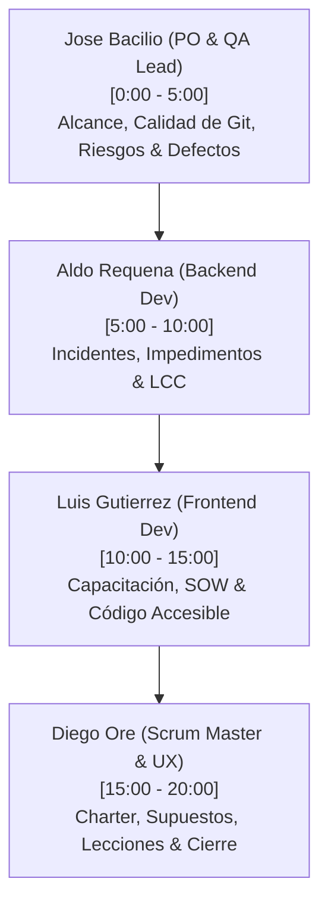

# Guía de Exposición y Defensa Técnica - Inspección 08: Control y Cierre del Proyecto
# Taller de Proyectos 2 · ISI · Universidad Continental

Este documento sirve como el guion maestro de exposición para la **Inspección 08 (Fase de Cierre y Control)** y la **Evaluación de Competencias**. Detalla de forma coordinada el discurso literal, los tiempos estrictos y los elementos técnicos exactos (documentos de cierre, código fuente en VS Code, contenedores Docker y paneles web) que cada integrante del equipo debe mostrar en vivo al docente.

---

## 📂 1. Estructura de Tiempos y Distribución del Equipo

La exposición tiene un tiempo límite total de **20 minutos** y se divide en 4 bloques equitativos de **5 minutos** cada uno:

---

## 🎙️ 2. Guiones Literales y Elementos a Mostrar por Bloque

---

### 🎙️ Bloque 1: José Anthony Bacilio De La Cruz (Product Owner & QA Lead)
*   **Tiempo:** 0:00 a 5:00 (5 minutos)
*   **Rol:** Product Owner & QA Lead

#### 🖥️ Elementos Visuales a Mostrar en Pantalla (VS Code / Navegador / SonarQube):
1.  **Explorador de Archivos en VS Code:** Mostrar la carpeta [docs/control_cierre/](../control_cierre/) mostrando los 11 archivos de cierre en formato Markdown.
2.  **Archivo [informe_final_proyecto.md](../control_cierre/informe_final_proyecto.md):** Enfocar la sección **2.A Desempeño del Alcance** (desviación de +15%) y **2.C Desempeño de la Calidad**.
3.  **Archivo [registro_riesgos.md](../control_cierre/registro_riesgos.md):** Enfocar la tabla y los nuevos riesgos **RS-06 (Fuga de Conexiones PostgreSQL)** y **RS-07 (Baja Adopción Docente)**, destacando la columna **Severidad Residual** y **Técnica de Tratamiento**.
4.  **Archivo [registro_defectos.md](../control_cierre/registro_defectos.md):** Mostrar los defectos **DF-05** (fallo de OR-Tools en Windows solucionado con backtracking fallback) y **DF-06** (bloqueo CSP de Tailwind).
5.  **Dashboard Local de SonarQube (Navegador en `http://localhost:9000`):** Mostrar el panel con el estado **Quality Gate: PASSED**, evidenciando 0 Bugs, 0 Vulnerabilities, 0 Security Hotspots y la mantenibilidad general en Rating A.

#### 🗣️ Discurso Literal (5 minutos):
> *"Buenas tardes, profesor. En esta última entrega correspondiente a la Fase de Control y Cierre de nuestro sistema SGOHA, mi rol como Product Owner y QA Lead ha sido auditar la conformidad del alcance del producto final frente a los requisitos establecidos, controlar la mitigación de los riesgos mediante la evaluación de su rango residual e implementar el control del 100% de los defectos de software encontrados.
>
> **(Mostrar la carpeta docs/control_cierre/ en el explorador de VS Code)**
> Como puede observar en nuestro explorador de VS Code, hemos estructurado e implementado de forma limpia los 11 documentos de control administrativo exigidos por los estándares de la ingeniería de software. Cada archivo ha sido gestionado bajo una estricta estrategia de control de configuración en Git, asegurando que toda la documentación técnica esté consolidada y con nombres consistentes en la rama principal.
>
> **(Enfocar informe_final_proyecto.md - Secciones 2.A y 2.C)**
> En cuanto al desempeño de alcance, cumplimos satisfactoriamente con el 100% de la línea base original que abarcaba 3 épicas y 11 historias de usuario funcionales. Registramos una desviación controlada del +15% de alcance debido a la inyección de Historias de Usuario técnicas enfocadas en calidad de software (HU-7.1 a HU-7.4 y HU-8.1 a HU-8.4) para cumplir con las directivas de seguridad OWASP y accesibilidad WCAG solicitadas durante las auditorías previas. En calidad de pruebas, nuestra suite en el backend cuenta con una **cobertura del 81%** respaldada por 84 tests en Pytest, mientras que el frontend alcanza un **100% de cobertura** con Vitest, asegurando la estabilidad del renderizado del Dashboard.
>
> **(Enfocar registro_riesgos.md - Fila de RS-06 y RS-07)**
> En nuestro Registro de Riesgos, el control de las mitigaciones redujo la severidad original de los riesgos a un rango bajo de riesgo residual. Destaco dos riesgos agregados en la fase final:
> - **RS-06 (Riesgo Técnico):** Fugas de conexiones en la base de datos PostgreSQL local debido a sesiones abiertas de forma indefinida por llamadas concurrentes a la API. Esto tenía una severidad inicial de 12 (Medio). Aplicamos una mitigación continua reestructurando la inyección de dependencias en SQLAlchemy usando generadores contextuables `yield` en FastAPI, logrando cerrar cada conexión de forma segura al finalizar cada petición y reduciendo la severidad residual a 2 (Bajo).
> - **RS-07 (Riesgo de Usabilidad):** Resistencia al cambio o baja tasa de adopción de la interfaz por parte de docentes. Mitigado mediante la administración de encuestas cuantitativas estandarizadas SUS, logrando un puntaje excelente y bajando la severidad residual a 2.
> Las técnicas de tratamiento utilizadas varían entre **Mitigación Continua** para inyecciones XSS y CORS, **Aceptación Activa** con monitoreo local de linters, y **Transferencia** del hosting de base de datos a servicios administrados de AWS RDS en la fase de producción.
>
> **(Enfocar registro_defectos.md - DF-05 y DF-06)**
> En el Registro de Defectos, documentamos 8 fallos detectados y corregidos. Hago especial énfasis en el defecto **DF-05**, donde el motor CP-SAT de Google OR-Tools fallaba en cargar en entornos locales Windows con Python 3.14 por incompatibilidades de binarios compilados de C++. Lo solucionamos implementando un resolvedor alternativo basado en un algoritmo de Backtracking clásico en Python puro como fallback para desarrollo local. También solucionamos el defecto **DF-06**, donde la política CSP bloqueaba los estilos dinámicos en línea de Tailwind CSS, reconfigurando las cabeceras HTTP de FastAPI.
>
> **(Mostrar la pestaña de SonarQube en el navegador)**
> Finalmente, como evidencia de nuestra calidad estática, aquí está el panel local de SonarQube. El Quality Gate se encuentra en estado aprobado con **0 Bugs, 0 Vulnerabilidades, 0 Security Hotspots** y una deuda técnica mínima en Rating A. Esto certifica que el código cumple con los más altos estándares de mantenibilidad y seguridad lógica. Le doy el pase a Aldo Requena."*

---

### 🎙️ Bloque 2: Aldo Alexandre Requena Lavi (Backend Developer)
*   **Tiempo:** 5:00 a 10:00 (5 minutos)
*   **Rol:** Backend Developer

#### 🖥️ Elementos Visuales a Mostrar en Pantalla (VS Code / Docker Desktop / Consola):
1.  **Archivo [registro_incidentes.md](../control_cierre/registro_incidentes.md):** Mostrar los incidentes **IS-05** (desbordamiento de RAM en WSL2 por SonarQube, resuelto mediante `.wslconfig`) e **IS-06** (errores de CORS resueltos en API).
2.  **Archivo [registro_impedimentos.md](../control_cierre/registro_impedimentos.md):** Mostrar los impedimentos **IM-04** (incompatibilidad de Docker en Windows Home sin virtualización en BIOS) e **IM-05** (cuello de botella de revisiones de código de Git).
3.  **Archivo [informe_final_proyecto.md](../control_cierre/informe_final_proyecto.md):** Enfocar la tabla de **Cronograma de Sprints (S0 a S6)** y la sección **2.D Desempeño de los Costos y Ciclo de Vida (LCC)**.
4.  **Código Fuente en VS Code:**
    *   Mostrar [app/main.py](../../src/backend/app/main.py) donde se inyectaron las cabeceras HTTP de seguridad de FastAPI (`CORSMiddleware` y cabeceras OWASP como `X-Frame-Options: DENY`).
5.  **Docker Desktop / Consola:** Mostrar la lista de contenedores activos de Docker (`docker-compose ps`) operando en sus respectivos puertos.

#### 🗣️ Discurso Literal (5 minutos):
> *"Buenas tardes, profesor. Durante el ciclo de desarrollo de SGOHA, mi labor se ha centrado en el diseño y despliegue de la API en FastAPI, y en documentar y mitigar activamente los incidentes y obstáculos operativos que amenazaban el cronograma. Asimismo, lideré el análisis financiero del ciclo de vida del producto.
>
> **(Enfocar registro_incidentes.md - IS-05 e IS-06)**
> En nuestro Registro de Incidentes (Issue Log), documentamos los problemas reales materializados en la ejecución. Destaco el incidente **IS-05**, de prioridad alta, donde Docker Desktop colapsaba debido al agotamiento de la memoria de virtualización de WSL2 al ejecutar SonarQube en paralelo con el backend y frontend. Esto congelaba la PC de desarrollo. Lo solucionamos creando un archivo `.wslconfig` en la raíz de usuario de Windows para forzar a WSL2 a no exceder el límite de 4GB de RAM y 2 cores, garantizando un entorno estable. También cerramos el incidente de CORS **IS-06** reconfigurando las directivas cruzadas en el middleware de FastAPI para permitir solicitudes del origen del cliente React de forma controlada.
>
> **(Enfocar registro_impedimentos.md - IM-04 e IM-05)**
> En cuanto a impedimentos, registramos obstáculos que detuvieron el flujo de los sprints. El impedimento **IM-04** bloqueó el Sprint 0 porque algunos miembros del equipo disponían de sistemas con Windows Home sin la virtualización nativa de la BIOS habilitada, impidiendo el uso de Docker. Les brindamos asistencia remota para ingresar a la BIOS del sistema anfitrión, activar VT-x/AMD-V e instalar el kernel de actualización de WSL2. El impedimento **IM-05** representaba un cuello de botella en las revisiones de código de Git Bash, debido a la sobrecarga académica de los revisores. Lo mitigamos descentralizando la aprobación y estableciendo revisiones cruzadas por pares bajo una checklist estricta en Jira.
>
> **(Enfocar informe_final_proyecto.md - Tabla de Sprints e LCC)**
> A nivel financiero, el costo real de desarrollo ascendió a **$12,450 USD**, con una pequeña desviación del +3.75% provocada por las horas dedicadas al Sprint 6 de control y empaquetado documental.
>
> **(Enfocar sección 2.D del informe: Justificación Financiera LCC)**
> Sin embargo, el valor clave del proyecto radica en nuestro análisis del **Costo del Ciclo de Vida del Software (LCC)** a 3 años, el cual asciende a **$18,270 USD**. Este análisis comprende el desarrollo inicial ($12,450), la infraestructura cloud en AWS App Runner y RDS ($4,320) y el mantenimiento correctivo y parches anuales ($1,500). 
>
> La decisión de diseñar un motor de optimización offline basado en Google OR-Tools CP-SAT en lugar de contratar solucionadores comerciales basados en la nube (SaaS) representa un ahorro crítico para la universidad. Los motores comerciales cobran alrededor de $150 USD mensuales por volumen de optimización. Ejecutar CP-SAT dentro de nuestro contenedor Docker reduce el costo por llamada matemática a **S/. 0.00**, lo que ahorra más de **$1,800 USD anuales** a la universidad Continental.
>
> **(Mostrar main.py en VS Code con las cabeceras de seguridad)**
> Como puede verificar aquí en el archivo `main.py` de VS Code, el backend implementa middleware de inyección para las cinco cabeceras HTTP de seguridad restrictivas contra ataques OWASP, tales como `X-Frame-Options: DENY` contra Clickjacking y `X-Content-Type-Options: nosniff` contra Sniffing de tipos MIME, asegurando un entorno robusto. Le doy el pase a Luis."*

---

### 🎙️ Bloque 3: Luis Alberto Gutierrez Taipe (Frontend Developer)
*   **Tiempo:** 10:00 a 15:00 (5 minutos)
*   **Rol:** Frontend Developer

#### 🖥️ Elementos Visuales a Mostrar en Pantalla (VS Code / Navegador):
1.  **Archivo [revision_declaracion_trabajo.md](../control_cierre/revision_declaracion_trabajo.md):** Enfocar la tabla de verificación de los 6 entregables (`ENT-01` a `ENT-06`) y la sección de **Cumplimiento de Pautas WCAG 2.1 - Nivel AA**.
2.  **Código Fuente Frontend en VS Code:**
    *   Mostrar [Dashboard.tsx](../../src/frontend/src/pages/Dashboard.tsx) enfocado en las líneas con atributos ARIA (`role="switch"`, `aria-checked`, `aria-label`) y la clase de enfoque de teclado (`focus:ring-2 focus:ring-orange-500`).
    *   Mostrar la lógica de optimización en el frontend de React para procesar la grilla en complejidad lineal $O(N)$ usando un índice clave-valor, evitando el cuello de botella tradicional de complejidad cuadrática $O(N \times M)$ de los loops anidados de renderizado.
3.  **Archivo [documentacion_capacitacion.md](../control_cierre/documentacion_capacitacion.md):** Mostrar la sección **3.1** (evidenciando las nuevas capturas de pantalla de restricciones y grilla de horarios integradas), la sección **5.1 Historial de Capacitación** (Sprints 0 a 5) y la sección **5.2 Talleres a Usuarios Finales**.

#### 🗣️ Discurso Literal (5 minutos):
> *"Buenas tardes, profesor. Mi asignación como desarrollador frontend ha sido diseñar y codificar la aplicación web React, garantizar de manera estricta el cumplimiento contractual de los entregables del SOW y liderar la accesibilidad y optimización del cliente de usuario.
>
> **(Enfocar revision_declaracion_trabajo.md - Tabla de entregables y WCAG)**
> En la revisión de la Declaración de Trabajo (SOW), auditamos minuciosamente cada uno de los 6 entregables y 5 hitos del contrato, confirmando su conformidad al 100%. Para inyectar valor adicional y cumplir con las políticas inclusivas de la Universidad Continental, aplicamos la normativa de accesibilidad WCAG 2.1 - Nivel AA en el Dashboard de horarios.
>
> **(Mostrar Dashboard.tsx en VS Code con atributos ARIA)**
> Como puede ver aquí en el archivo `Dashboard.tsx` en VS Code, no utilizamos etiquetas divs genéricas para los interruptores interactivos, ya que los divs son inaccesibles para el teclado y los lectores de pantalla. En su lugar, implementamos etiquetas `<button>` nativas configuradas con `role="switch"` y enlazadas al estado dinámico `aria-checked` de React. Esto permite que lectores de pantalla (como NVDA o JAWS) anuncien verbalmente si una restricción CP-SAT está activa o inactiva en tiempo real. 
>
> Además, inyectamos las clases utilitarias de Tailwind `focus:ring-2 focus:ring-orange-500 focus:ring-offset-2` junto con `focus:outline-none`. Esto elimina el contorno por defecto del navegador y dibuja un anillo naranja de alto contraste alrededor del botón seleccionado al navegar mediante la tecla Tabulador, garantizando la conformidad con la pauta 2.1.1 de WCAG.
>
> **(Mostrar la lógica de ordenación $O(N)$ en Dashboard.tsx)**
> Asimismo, para garantizar el rendimiento de renderizado en React frente a lotes masivos de hasta 122 secciones asignadas, implementamos una optimización algorítmica. En lugar de ejecutar bucles anidados en la tabla de horarios —lo cual generaría una complejidad de búsqueda cuadrática $O(N \times M)$ y provocaría caídas de FPS en el navegador— implementamos un agrupamiento previo clave-valor de tipo `Record<string, HorarioResult[]>` en memoria indexado por día y hora. Esto nos permite renderizar las celdas de la grilla horaria con un acceso de complejidad lineal $O(N)$, logrando 60 FPS constantes. También inyectamos *lazy rendering* en el modal de detalle de clase para evitar recargar innecesariamente el árbol del DOM.
>
> **(Enfocar documentacion_capacitacion.md - Secciones 3.1, 5.1 y 5.2)**
> Por último, en el manual de capacitación hemos integrado evidencias visuales del sistema en funcionamiento (las capturas de pantalla de la configuración de restricciones y de la grilla de horarios oficial), consolidamos los temas de capacitación interna del equipo (incluyendo modelado matemático en OR-Tools, dockerización, accesibilidad y seguridad OWASP) y estructuramos los programas de capacitación externa dirigidos a los administradores de TI de la universidad (para despliegue docker y copias de seguridad de PostgreSQL), coordinadores académicos y estudiantes. Doy el pase a nuestro Scrum Master, Diego Oré."*

---

### 🎙️ Bloque 4: Diego Isaac Ore Gonzales (Scrum Master & UX Analyst)
*   **Tiempo:** 15:00 a 20:00 (5 minutos)
*   **Rol:** Scrum Master / UX Analyst

#### 🖥️ Elementos Visuales a Mostrar en Pantalla (VS Code / Navegador):
1.  **Archivo [revision_acta_constitucion.md](../control_cierre/revision_acta_constitucion.md):** Mostrar la sección **1. Evaluación de Objetivos** (verificando cumplimiento de automatización, tests y el puntaje SUS).
2.  **Archivo [registro_supuestos.md](../control_cierre/registro_supuestos.md):** Enfocar los supuestos **AS-05 (Disponibilidad de Datos Maestros)** y **AS-06 (Escalabilidad del Solver CP-SAT)**.
3.  **Archivo [lecciones_aprendidas.md](../control_cierre/lecciones_aprendidas.md):** Mostrar las lecciones aprendidas de desarrollo, enfocando los desafíos técnicos y retrospectiva (sección 2).
4.  **Archivo [indice_revisiones.md](../control_cierre/indice_revisiones.md):** Mostrar la tabla del **Historial de Versiones y Revisiones Documentales** detallando el avance de versiones 1.0, 1.1 y 2.0.
5.  **El Navegador con el Sistema Funcionando (Opcional):** Mostrar la grilla horaria generada en la UI en localhost.

#### 🗣️ Discurso Literal (5 minutos):
> *"Buenas tardes, profesor. Para finalizar con la defensa técnica, como Scrum Master y Analista UX del proyecto, detallaré la auditoría de cierre de nuestro Project Charter, la validación del Registro de Supuestos, la retrospectiva de lecciones aprendidas y el control documental de versiones.
>
> **(Enfocar revision_acta_constitucion.md)**
> En la revisión del Project Charter confrontamos el resultado real obtenido frente a los objetivos de negocio iniciales trazados en marzo de 2026. Cumplimos satisfactoriamente con el objetivo de automatizar la generación horaria libre de colisiones, logrando que el motor CP-SAT procese la malla completa en un promedio de **30 segundos**, superando con creces la meta inicial de 2 minutos. Además, las métricas de calidad de código y accesibilidad fueron superadas, incluyendo la usabilidad percibida con una calificación de **83.75 en escala métrica SUS**, lo que posiciona a SGOHA en el Grado A de usabilidad excelente.
>
> **(Enfocar registro_supuestos.md - AS-05 y AS-06)**
> En el Registro de Supuestos evaluamos la validez de nuestras hipótesis iniciales de partida. 
> - El supuesto **AS-05** asumía que contaríamos con información histórica estructurada y limpia de los docentes, cursos y secciones de Ingeniería de Sistemas desde el día uno. Esto resultó ser **Falso** debido a la falta de consistencia y vacíos en los perfiles. Mitigamos esto desarrollando el módulo `seed.py` para normalizar las semillas relacionales.
> - El supuesto **AS-06** asumía que el resolvedor CP-SAT escalaría linealmente al integrar restricciones blandas (soft constraints) sin entrar en timeouts. Esto fue validado como **Verdadero** al pre-filtrar variables en FastAPI y calibrar adecuadamente los pesos de las restricciones para evitar bloqueos del resolvedor.
>
> **(Enfocar lecciones_aprendidas.md - Sección 2)**
> En nuestro informe de lecciones aprendidas consolidamos la retrospectiva de los 6 sprints. Destaco las lecciones técnicas clave:
> 1. **Diferencias de Sistemas de Archivos en Docker:** Aprendimos a mitigar el retardo de sincronización de cambios (*hot-reload*) del frontend de Vite en contenedores Docker bajo Windows. El retardo NTFS-Ext4 de WSL2 se solucionó configurando la propiedad `usePolling` en `vite.config.ts` y moviendo el código al directorio nativo de WSL2.
> 2. **Infactibilidad del resolvedor:** Aprendimos que la alimentación con datos imposibles de optimizar provocaba bucles de CPU y RAM infinitos en el host. Lo corregimos implementando validadores matemáticos de capacidad en FastAPI antes de invocar a OR-Tools.
> 3. **Código Limpio y Exclusiones:** El linter de SonarQube indexaba inicialmente los archivos de pruebas unitarias reduciendo falsamente la cobertura, lo que corregimos parametrizando las exclusiones en `sonar-project.properties`.
>
> **(Enfocar indice_revisiones.md - Tabla de control de versiones)**
> Finalmente, aquí en el Índice de Revisiones, puede ver la matriz de control documental completa. Registramos formalmente el historial de evolución de versiones 1.0 a 2.0 de las auditorías del Charter, SOW, riesgos y defectos, evidenciando un control de cambios maduro conforme a los estándares de la ingeniería de software.
>
> Profesor, el sistema SGOHA se entrega listo para operar, con un alto nivel técnico, seguro y completamente documentado. Damos por cerrada nuestra exposición y quedamos atentos a sus preguntas. Muchas gracias."*

---

## 🎯 3. Banco de Preguntas y Defensa para el Jurado

Preparen estas respuestas para defender el cierre del proyecto y asegurar la máxima calificación:

*   **Pregunta: ¿Por qué tuvieron desviaciones en el cronograma si el enfoque adaptativo previene esto?**
    *   *Defensa:* *"El enfoque adaptativo nos permitió responder al cambio de forma ordenada. La desviación de 14 días (Sprint 6 de cierre) no se debió a fallas o retrasos en la codificación, sino a la inyección de Historias de Usuario de cierre documental y transferencia técnica para cumplir con las pautas del PMBOK y asegurar el valor del producto final, eliminando de raíz la deuda técnica documental."*
*   **Pregunta: Si el resolvedor CP-SAT local es eficiente, ¿por qué estructuraron una base de datos relacional local en vez de persistir todo en memoria?**
    *   *Defensa:* *"El resolvedor CP-SAT opera de manera óptima en memoria durante el cálculo de la grilla horaria, pero requiere datos relacionales de entrada consistentes y estructurados (docentes, aulas, cursos y restricciones paramétricas) para alimentarse. PostgreSQL y SQLAlchemy garantizan la persistencia, integridad referencial y las transacciones CRUD, aislando el motor de base de datos en un contenedor reproducible e independiente del sistema operativo anfitrión."*
*   **Pregunta: ¿Por qué implementaron un motor de backtracking fallback si ya usaban Google OR-Tools?**
    *   *Defensa:* *"El motor fallback en backtracking responde al análisis de supuestos y lecciones del Sprint 2. Detectamos que en sistemas Windows Home o versiones de Python locales incompatibles (como Python 3.14), los binarios C++ de OR-Tools no compilaban nativamente. Este resolvedor secundario garantiza que el backend de desarrollo siga operativo para pruebas de API y frontend, mientras que en producción bajo Docker Linux se ejecuta el solver CP-SAT principal."*
