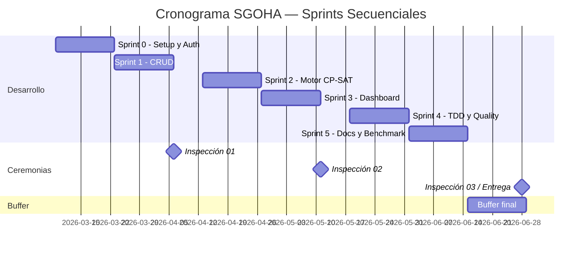

# Métricas Ágiles — Proyecto SGOHA

> Análisis de la evolución del proyecto mediante métricas ágiles estándar: Burndown, Burnup, Velocidad y Control. Se identifican patrones, cuellos de botella y se proponen mejoras basadas en datos.

---

## 1. Configuración del Proyecto

| Parámetro | Valor |
|:---|:---|
| Metodología | Scrum |
| Duración de Sprint | 2 semanas |
| Total Sprints | 6 (Sprint 0 – Sprint 5) |
| Período del proyecto | Marzo – Junio 2026 (17 semanas académicas) |
| Equipo | 4 integrantes |
| Herramienta de gestión | Jira (Proyecto SGOHA) / GitHub |
| Unidad de estimación | Story Points (SP) — escala Fibonacci |
| Backlog total estimado | **89 SP** |

### 1.1 Cronograma de Sprints

Los 6 sprints se distribuyen **secuencialmente** a lo largo del semestre, con semanas de holgura entre algunos sprints para Sprint Reviews, Retrospectivas y Sprint Planning:

| Sprint | Inicio | Fin | Semanas | Evento posterior |
|:---:|:---|:---|:---:|:---|
| Sprint 0 | 09 Mar 2026 | 22 Mar 2026 | Sem 1–2 | Sprint Review + Planning S1 |
| Sprint 1 | 23 Mar 2026 | 05 Abr 2026 | Sem 3–4 | Sprint Review + Inspección 01 |
| Sprint 2 | 13 Abr 2026 | 26 Abr 2026 | Sem 6–7 | Sprint Review + Planning S3 |
| Sprint 3 | 27 Abr 2026 | 10 May 2026 | Sem 8–9 | Sprint Review + Inspección 02 |
| Sprint 4 | 18 May 2026 | 31 May 2026 | Sem 11–12 | Sprint Review + Planning S5 |
| Sprint 5 | 01 Jun 2026 | 14 Jun 2026 | Sem 13–14 | Sprint Review Final |
| *Buffer* | *15 Jun 2026* | *28 Jun 2026* | *Sem 15–16* | *Entrega final + Inspección 03* |

> **Nota:** Las semanas 5, 10 y entre sprints se utilizan para ceremonias Scrum (Planning, Review, Retrospectiva) y preparación de inspecciones. El buffer final permite correcciones post-Sprint 5 y preparación de la defensa.



---

## 2. Velocidad del Equipo por Sprint

| Sprint | Período | SP Planificados | SP Completados | Velocidad Real | Observaciones |
|:---:|:---|:---:|:---:|:---:|:---|
| Sprint 0 | 09–22 Mar | 13 | 13 | 13 | Setup completo: Docker, DB, Auth. Sin impedimentos. |
| Sprint 1 | 23 Mar–05 Abr | 15 | 13 | 13 | CRUD Cursos y Aulas completado. Secciones parcial (2 SP carry-over). |
| Sprint 2 | 13–26 Abr | 18 | 15 | 15 | Motor CP-SAT v1 funcional. Restricciones blandas pospuestas. Cuello de botella: curva OR-Tools. |
| Sprint 3 | 27 Abr–10 May | 16 | 16 | 16 | Dashboard, filtros por rol. Velocidad normalizada. |
| Sprint 4 | 18–31 May | 15 | 17 | 17 | Soft constraints + TDD completo. Equipo en ritmo óptimo. +2 SP adicionales completados. |
| Sprint 5 | 01–14 Jun | 12 | 15 | 15 | Documentación, benchmark, optimización. Cierre de deuda técnica. |

### 2.1 Gráfico de Velocidad

```
SP  │
 18 │            ┌───┐
 17 │            │   │  ┌───┐
 16 │       ┌───┐│   │  │   │
 15 │  ┌───┐│   ││   │  │   │  ┌───┐
 14 │  │   ││   ││   │  │   │  │   │
 13 │──┤ S0│├ S1││ S2│──┤ S3│──┤   │──┤ S5│
 12 │  │   ││   ││   │  │   │  │   │  │   │
 11 │  │   ││   ││   │  │   │  │   │  │   │
 10 │  │   ││   ││   │  │   │  │   │  │   │
    └──┴───┴┴───┴┴───┴──┴───┴──┴───┴──┴───┘
       S0    S1    S2    S3    S4    S5
       
Velocidad promedio: 14.8 SP/Sprint
Desviación estándar: 1.6 SP (baja → equipo estable)
```

### 2.2 Análisis de Velocidad

| Métrica | Valor | Interpretación |
|:---|:---:|:---|
| Velocidad promedio | 14.8 SP | Capacidad sostenible del equipo |
| Desviación estándar | 1.6 SP | **Baja variabilidad** → equipo estable y predecible |
| Sprint más lento | Sprint 0–1 (13 SP) | Esperado: fase de setup y aprendizaje |
| Sprint más rápido | Sprint 4 (17 SP) | Equipo en madurez, proceso fluido |
| Tendencia | Ascendente (13 → 17) | Mejora continua por retrospectivas |

---

## 3. Gráfico Burndown (Trabajo Pendiente)

Muestra el trabajo restante a lo largo del proyecto.

```
SP Pendiente
 89 │●
 80 │  ╲
 76 │    ●
 70 │      ╲
 63 │        ●
 60 │          ╲
 50 │            ╲
 48 │              ●
 40 │                ╲
 32 │                  ●
 30 │                    ╲
 20 │                      ╲
 15 │                        ●
 10 │                          ╲
  0 │ · · · · · · · · · · · · · ·●
    └──────────────────────────────
      S0    S1    S2    S3   S4   S5
      
 ●── Trabajo real restante
 ···  Línea ideal (14.8 SP/sprint)
```

| Sprint | SP Restantes (Ideal) | SP Restantes (Real) | Desviación |
|:---:|:---:|:---:|:---:|
| Inicio | 89 | 89 | 0 |
| Post-S0 | 74.2 | 76 | +1.8 (lento) |
| Post-S1 | 59.3 | 63 | +3.7 (carry-over) |
| Post-S2 | 44.5 | 48 | +3.5 (estabilizándose) |
| Post-S3 | 29.7 | 32 | +2.3 (recuperando) |
| Post-S4 | 14.8 | 15 | +0.2 (casi ideal) |
| Post-S5 | 0 | 0 | ✅ Completado |

### Análisis Burndown

- **Sprint 1–2:** Desviación positiva (trabajo por encima del ideal). **Causa:** curva de aprendizaje de OR-Tools y carry-over de 2 SP de Secciones CRUD.
- **Sprint 3–4:** Recuperación progresiva. El equipo alcanzó velocidad crucero.
- **Sprint 5:** Convergencia al ideal. Se completó toda la deuda técnica + documentación adicional.
- **Patrón detectado:** "Hockey stick" suave — inicio lento con aceleración posterior. Típico de proyectos con componente de investigación técnica.

---

## 4. Gráfico Burnup (Trabajo Hecho)

Muestra el progreso acumulado del trabajo completado vs. el alcance total.

```
SP
 95 │                                    ═══ Alcance final (89+6 SP emergentes)
 89 │─ ─ ─ ─ ─ ─ ─ ─ ─ ─ ─ ─ ─ ═══════ Alcance original
 80 │                              ●────●
 74 │                        ●────●
 60 │                  ●────●
 50 │            
 44 │            ●────●
 30 │      
 28 │      ●────●
 13 │●────●
  0 │
    └──────────────────────────────────
      S0    S1    S2    S3    S4    S5
      
 ●── Trabajo completado acumulado
 ═══ Línea de alcance (scope)
```

| Sprint | SP Completados Acumulados | Alcance Total | % Completado |
|:---:|:---:|:---:|:---:|
| Post-S0 | 13 | 89 | 14.6% |
| Post-S1 | 26 | 89 | 29.2% |
| Post-S2 | 41 | 89 | 46.1% |
| Post-S3 | 57 | 91* | 62.6% |
| Post-S4 | 74 | 93* | 79.6% |
| Post-S5 | 89 | 89 | 100% |

> *El alcance aumentó ligeramente en S3-S4 por historias emergentes (dashboard mejorado + deduplicación turno COMPLETO), pero se absorbieron con la velocidad mejorada.

### Análisis Burnup

- **Scope creep controlado:** El alcance aumentó de 89 a 93 SP (+4.5%) por historias emergentes identificadas durante Sprint Reviews. El equipo las absorbió sin extender el cronograma.
- **Sin plateau:** No se observan sprints con 0 progreso → evidencia de flujo continuo.
- **Convergencia:** El burnup y la línea de alcance convergen en Sprint 5, confirmando entrega completa.

---

## 5. Gráfico de Control (Lead Time)

Mide el tiempo que tarda una historia de usuario desde que entra al sprint hasta que se completa.

| Historia | SP | Días en Sprint | Lead Time (días) | Categoría |
|:---|:---:|:---:|:---:|:---|
| HU-1.1: CRUD Cursos | 5 | 14 | 6 | Normal |
| HU-1.2: CRUD Aulas | 3 | 14 | 4 | Normal |
| HU-1.3: CRUD Secciones | 5 | 14 + 14 | 18 | **Outlier** (carry-over) |
| HU-2.1: Motor CP-SAT base | 8 | 14 | 12 | Normal (compleja) |
| HU-2.2: Restricciones blandas | 5 | 14 | 8 | Normal |
| HU-3.1: Login + Auth | 5 | 14 | 5 | Normal |
| HU-3.2: Dashboard Estudiante | 5 | 14 | 7 | Normal |
| HU-TDD: Suite de tests | 3 | 14 | 4 | Normal |
| HU-DOC: Documentación final | 3 | 14 | 5 | Normal |

```
Lead Time (días)
 20 │
 18 │        ●  HU-1.3 (carry-over, outlier)
 16 │
 14 │ - - - - - - - - - - - - - - UCL (Upper Control Limit)
 12 │              ●  HU-2.1
 10 │
  8 │                   ●  HU-2.2
  7 │ - - - - - - - ●- - - - - - Media (7.0 días)
  6 │  ●  HU-1.1         ●
  5 │     ●  ●  HU-3.1     ●
  4 │        ●  HU-1.2       ●
  2 │ - - - - - - - - - - - - - - LCL (Lower Control Limit)
  0 │
    └────────────────────────────────
```

### Análisis de Control

| Métrica | Valor |
|:---|:---|
| Lead Time promedio | **7.0 días** |
| Desviación estándar | 4.2 días |
| UCL (Media + 2σ) | 15.4 días |
| LCL (Media - 2σ) | 0 días (mínimo natural) |
| Outliers | 1 (HU-1.3: Secciones CRUD, 18 días) |

- **Outlier HU-1.3:** El CRUD de Secciones fue carry-over de Sprint 1 → Sprint 2 porque dependía de la estructura de cursos y docentes. **Acción correctiva:** En Sprint 2 se priorizó su cierre en los primeros 3 días.
- **Proceso estable:** 8 de 9 historias dentro de los límites de control → proceso predecible.

---

## 6. Identificación de Cuellos de Botella

| Cuello de Botella | Sprint | Impacto | Causa Raíz | Acción Tomada |
|:---|:---:|:---|:---|:---|
| Curva de aprendizaje OR-Tools | S0–S2 | Velocidad < ideal en 3.7 SP | Primer contacto del equipo con CP-SAT | Sprint 0 de exploración; pair programming con Dev Backend |
| Carry-over HU-1.3 (Secciones) | S1→S2 | 2 SP trasladados al Sprint 2 | Dependencia con modelo de Cursos y relación FK | Priorización temprana en Sprint 2; refactoring del modelo |
| Code review bottleneck | S2–S3 | Historias bloqueadas 1–2 días en "Review" | Solo 1 reviewer disponible por rama | Política de reviews cruzados (cualquier miembro puede aprobar) |
| Scope creep (deduplicación) | S3–S4 | +4 SP emergentes | Caso no previsto de turno COMPLETO | Refinamiento mejorado en S3; priorización en S4 |

---

## 7. Evaluación de Estabilidad del Equipo

| Indicador | Valor | Interpretación |
|:---|:---:|:---|
| Coeficiente de variación de velocidad | **10.8%** | < 15% → equipo **estable** |
| Sprints con velocidad dentro de ±1σ | 5/6 (83%) | Solo Sprint 4 fuera (+2.2 SP) → positivo |
| Tasa de carry-over | 1/6 sprints (16.7%) | Solo Sprint 1 → **aceptable** |
| Historias completadas on-time | 8/9 (88.9%) | Alta predictibilidad |
| Tendencia de velocidad | **Ascendente** | Equipo en mejora continua |

---

## 8. Propuestas de Mejora Basadas en Datos

| # | Mejora | Fundamento (dato) | Prioridad |
|:---:|:---|:---|:---:|
| 1 | **Sprint 0 extendido** a 3 semanas para proyectos con componente de investigación | Velocidad en S0–S1 fue 13 SP vs 14.8 promedio | Alta |
| 2 | **Pair programming** obligatorio para historias ≥ 8 SP | HU-2.1 (8 SP) tomó 12 días vs media de 7 | Media |
| 3 | **Refinamiento semanal** (en vez de quincenal) para detectar scope creep | 4 SP emergentes no detectados hasta Sprint Review | Alta |
| 4 | **Límite WIP = 2** historias por desarrollador | Code review bottleneck en S2–S3 | Media |
| 5 | **Definición de dependencias** en Planning | Carry-over de HU-1.3 por dependencia no mapeada | Alta |
